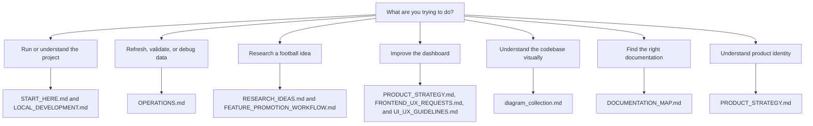

# Documentation Map

Use this map when you know the project has documentation for something, but you
are not sure which file should be opened first.

Start with [START_HERE.md](START_HERE.md) when you are new to the project or
unsure where a change belongs. Use this map after that to find the specific
reference doc.

## Reading Order

For most work:

1. Read [START_HERE.md](START_HERE.md).
2. Read the current-area doc listed below.
3. Read only the detailed reference docs needed for the task.
4. If two docs disagree, prefer [START_HERE.md](START_HERE.md) and
   [PROJECT_ROADMAP.md](PROJECT_ROADMAP.md), then update the stale doc in the
   smallest useful place.

## Current Planning Docs

These docs describe how the project should be understood now.

| Doc | Status | Open it when |
|-----|--------|--------------|
| [START_HERE.md](START_HERE.md) | Primary entrypoint | You are new, choosing a work area, or checking the four-area model. |
| [PRODUCT_STRATEGY.md](PRODUCT_STRATEGY.md) | Product identity and positioning source of truth | You need to understand what the public app is, what it is not, who it serves, and how product strategy should guide technical work. |
| [LOCAL_DEVELOPMENT.md](LOCAL_DEVELOPMENT.md) | Local developer guide | You need setup steps, common commands, verification checks, or local troubleshooting. |
| [diagram_collection.md](diagram_collection.md) | Visual system overview | You need a high-level diagram of the codebase, data pipeline, database shape, API flow, or scraper lifecycle. |
| [PROJECT_ROADMAP.md](PROJECT_ROADMAP.md) | Current planning map plus launch history | You need priorities, architecture direction, or historical milestone context. |
| [DOCUMENTATION_MAP.md](DOCUMENTATION_MAP.md) | Navigation aid | You need to find the right doc without reading everything. |

## Data Reliability & Operations

These docs support scraping, loading, validation, automation, deployment health,
and escalation.

| Doc | Status | Open it when |
|-----|--------|--------------|
| [OPERATIONS.md](OPERATIONS.md) | Current operations standard | You need logs, tests, validation, run summaries, or escalation rules. |
| [PHASE5_AUTOMATION.md](PHASE5_AUTOMATION.md) | Detailed automation reference / historical launch-phase note | You need GitHub Actions current-season refresh details, secrets, artifacts, or automation troubleshooting. |
| [PHASE7_DEPLOYMENT_RUNBOOK.md](PHASE7_DEPLOYMENT_RUNBOOK.md) | Deployment runbook / historical launch-phase reference | You need hosted Supabase, Render, Cloudflare Pages, CORS, or browser-blocking troubleshooting steps. |
| [DEPLOYMENT_PLAN.md](DEPLOYMENT_PLAN.md) | Historical deployment decision record | You need to understand why the current hosted architecture was chosen. |

## Research & Football Intelligence

These docs support notebook research, football questions, feature packages, and
promotion decisions.

| Doc | Status | Open it when |
|-----|--------|--------------|
| [RESEARCH_IDEAS.md](RESEARCH_IDEAS.md) | Editable idea backlog | You are choosing or shaping the next football question before a feature package exists. |
| [FEATURE_PROMOTION_WORKFLOW.md](FEATURE_PROMOTION_WORKFLOW.md) | Current feature workflow | You are turning a notebook idea into a production-ready feature plan. |
| [FEATURE_DATA_ACCESS.md](FEATURE_DATA_ACCESS.md) | Current notebook data-source guide | You need to know when to use `staging.*`, `raw.*`, CSVs, or `analytics.*`. |
| [FEATURE_REGISTRY.md](FEATURE_REGISTRY.md) | Small factual feature index | You need current feature status, production source, endpoint, or UI surface. |
| [ANALYTICS_VIEW_CONVENTIONS.md](ANALYTICS_VIEW_CONVENTIONS.md) | Analytics contract guide | You are deciding between a direct API query, an `analytics.*` view, or a stored analytics table. |

## Product Experience

These docs support FastAPI and React product work.

| Doc | Status | Open it when |
|-----|--------|--------------|
| [PRODUCT_STRATEGY.md](PRODUCT_STRATEGY.md) | Product identity and positioning source of truth | You are planning product-facing API, frontend, research-promotion, or UX work. |
| [FRONTEND_UX_REQUESTS.md](FRONTEND_UX_REQUESTS.md) | Editable UI/UX request source of truth | You are planning or implementing frontend improvements. |
| [UI_UX_GUIDELINES.md](UI_UX_GUIDELINES.md) | Approved UI/UX decisions | You need durable design/product rules that are already approved or implemented. |
| [FEATURE_PROMOTION_WORKFLOW.md](FEATURE_PROMOTION_WORKFLOW.md) | Shared with Research & Football Intelligence | A product feature must stay traceable to notebook research and a product plan. |

## Developer Experience & Documentation

These docs support onboarding, setup clarity, command navigation, and AI-agent
alignment.

| Doc | Status | Open it when |
|-----|--------|--------------|
| [START_HERE.md](START_HERE.md) | Primary contributor entrypoint | You need beginner-readable orientation or work-area boundaries. |
| [LOCAL_DEVELOPMENT.md](LOCAL_DEVELOPMENT.md) | Local developer guide | You need first-run setup, common commands, verification guidance, or troubleshooting. |
| [DOCUMENTATION_MAP.md](DOCUMENTATION_MAP.md) | Doc navigation index | You need to know what every docs file is for. |
| [diagram_collection.md](diagram_collection.md) | Maintained visual overview | You need to understand or update high-level diagrams after codebase changes. |
| [PROJECT_ROADMAP.md](PROJECT_ROADMAP.md) | Current planning map | You need to keep documentation changes aligned with project direction. |

Related repo-root guidance:

- `AGENTS.md` is the main AI-agent working contract.
- `.github/copilot-instructions.md` is the GitHub Copilot-facing version of the
  same project guidance.
- `README.md` is the public-facing overview and live-demo entrypoint. Keep it
  shorter and more public-facing than the internal docs.

## Historical And Reference Docs

The old launch phases are not the main planning model anymore. They remain
useful because they explain how important systems were built.

Use phase-named docs this way:

- Use them for exact operational details, runbooks, and context.
- Do not use them to decide the main scope model for new work.
- When adding new work, classify it under one of the four continuous development
  areas in [START_HERE.md](START_HERE.md).

## Updating Docs Without Creating Clutter

When code changes, update the smallest doc that owns the changed behavior.

Use these rules:

- Update [OPERATIONS.md](OPERATIONS.md) when logs, tests, validation, or
  escalation behavior changes.
- Update [LOCAL_DEVELOPMENT.md](LOCAL_DEVELOPMENT.md) when local setup, common
  commands, verification steps, or local troubleshooting changes.
- Update [diagram_collection.md](diagram_collection.md) when architecture,
  major workflows, endpoints, database tables, deployment shape, or known gaps
  change.
- Update [FEATURE_PROMOTION_WORKFLOW.md](FEATURE_PROMOTION_WORKFLOW.md),
  [FEATURE_DATA_ACCESS.md](FEATURE_DATA_ACCESS.md), or
  [FEATURE_REGISTRY.md](FEATURE_REGISTRY.md) when research promotion behavior
  changes.
- Update [FRONTEND_UX_REQUESTS.md](FRONTEND_UX_REQUESTS.md) for proposed UI/UX
  changes and [UI_UX_GUIDELINES.md](UI_UX_GUIDELINES.md) for approved durable
  UI/UX decisions.
- Update [PRODUCT_STRATEGY.md](PRODUCT_STRATEGY.md) only when the app's product
  identity, audience, positioning, or decision rules change.
- Update [START_HERE.md](START_HERE.md) only when orientation or work-area
  ownership changes.
- Update this map when a docs file is added, renamed, split, or changes purpose.

Avoid repeating the same instructions in every file. Prefer one source of truth
and link to it.
