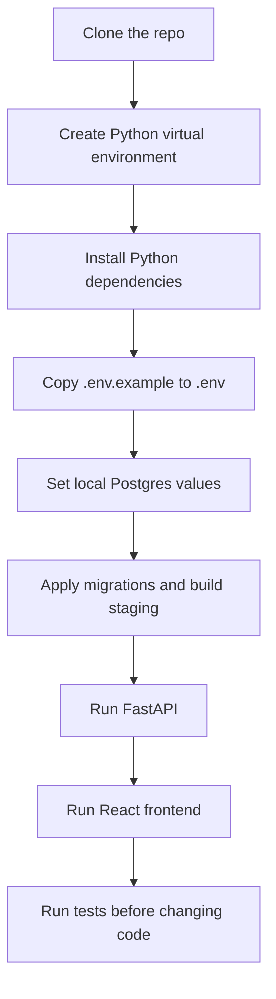

# Local Development And Operations

This guide is the practical path for running, checking, refreshing, validating,
and debugging the UPL Lens repo.

Use [START_HERE.md](START_HERE.md) for project orientation and current
high-signal history before digging deeper.

## First 30 Minutes

This is the shortest useful path for a new developer.



Recommended PowerShell flow:

```powershell
py -m venv .venv
.venv\Scripts\python.exe -m pip install -r requirements.txt
Copy-Item .env.example .env
Copy-Item frontend\.env.example frontend\.env
```

Then edit `.env` with local Postgres values:

```text
POSTGRES_HOST
POSTGRES_PORT
POSTGRES_DB
POSTGRES_USER
POSTGRES_PASSWORD
POSTGRES_SSLMODE
ALLOWED_ORIGINS
```

For local frontend development, `frontend/.env` should normally contain:

```text
VITE_API_BASE_URL=http://127.0.0.1:8000
```

## Common Commands

Use `.venv\Scripts\python.exe` when the local virtual environment exists.

| Task | Command |
|------|---------|
| Install Python dependencies | `.venv\Scripts\python.exe -m pip install -r requirements.txt` |
| Install API-only dependencies | `.venv\Scripts\python.exe -m pip install -r requirements-api.txt` |
| Install automation dependencies | `.venv\Scripts\python.exe -m pip install -r requirements-automation.txt` |
| Apply database migrations | `.venv\Scripts\python.exe scripts\data_platform\apply_db_migrations.py` |
| Load raw CSVs into Postgres | `.venv\Scripts\python.exe scripts\data_platform\load_raw_to_postgres.py` |
| Verify raw Postgres counts | `.venv\Scripts\python.exe scripts\data_platform\verify_raw_postgres_counts.py` |
| Build staging tables | `.venv\Scripts\python.exe scripts\data_platform\build_staging_from_raw.py` |
| Verify staging outputs | `.venv\Scripts\python.exe scripts\data_platform\verify_staging_outputs.py` |
| Refresh current season safely | `.venv\Scripts\python.exe scripts\data_platform\update_hosted_data.py --season-scope current --run-type routine-refresh` |
| Run Python tests | `.venv\Scripts\python.exe -m pytest` |
| Run FastAPI locally | `.venv\Scripts\python.exe -m uvicorn api.main:app --reload` |
| Install frontend dependencies | `cd frontend` then `npm install` |
| Run frontend dev server | `cd frontend` then `npm run dev` |
| Build frontend | `cd frontend` then `npm run build` |
| Preview frontend build | `cd frontend` then `npm run preview` |

## Local App Flow

Run the backend first:

```powershell
.venv\Scripts\python.exe -m uvicorn api.main:app --reload
```

Then open:

```text
http://127.0.0.1:8000/docs
```

In a second terminal, run the frontend:

```powershell
cd frontend
npm install
npm run dev
```

Then open:

```text
http://127.0.0.1:5173
```

The frontend should call the backend at:

```text
http://127.0.0.1:8000
```

## What Can Run Without Postgres?

Some checks do not need a live database:

- many unit tests around parsing and orchestration helpers
- `npm run build`
- frontend static type/build checks
- documentation edits and link checks

These usually need Postgres settings and reachable tables:

- `GET /health`
- most API endpoints
- raw count verification
- staging rebuilds
- staging output verification
- current-season refresh in full mode

If a command fails because Postgres is not configured, first check `.env` and
then check whether your local database exists.

## What To Run After Each Change

Use this table to avoid guessing.

| Change type | Minimum useful verification |
|-------------|-----------------------------|
| Documentation only | Read the changed doc and run a markdown-link check if links changed. |
| Python parsing or helper logic | `.venv\Scripts\python.exe -m pytest` |
| Scraper or raw-loading behavior | Relevant pytest tests, then `verify_raw_postgres_counts.py` if data changed. |
| Staging or validation logic | Relevant pytest tests, then `build_staging_from_raw.py` and `verify_staging_outputs.py`. |
| Current-season automation | Relevant pytest tests, then `update_hosted_data.py --season-scope current --run-type routine-refresh` for routine mode. |
| FastAPI route or schema | `.venv\Scripts\python.exe -m pytest`, run `uvicorn`, then check `/docs` and the affected endpoint. |
| React frontend | `cd frontend`, then `npm run build`; run the dev server for visual checks. |
| API response shape used by React | Verify the endpoint and run `npm run build`. |
| Deployment config | Check the local build command and the relevant deployment runbook before changing hosted settings. |

## Local Troubleshooting

### Python command cannot import project modules

Run commands from the repository root:

```text
C:\Personal Code Projects\upl-lens
```

Prefer:

```powershell
.venv\Scripts\python.exe -m pytest
```

instead of relying on whichever `python` happens to be first on `PATH`.

### `ModuleNotFoundError: No module named 'fastapi'`

The virtual environment probably does not have the API dependencies installed.
Run:

```powershell
.venv\Scripts\python.exe -m pip install -r requirements.txt
```

### Postgres connection fails

Check these first:

- `.env` exists.
- `.env` has the correct `POSTGRES_*` values.
- the database named by `POSTGRES_DB` exists.
- `POSTGRES_SSLMODE` is appropriate for local or hosted Postgres.
- the database user has permission to read the schemas used by the command.

For hosted Supabase pooler connections, usernames may need the project-reference
suffix, such as:

```text
upl_actions_loader.<project-ref>
```

The role inside Postgres is still normally just:

```text
upl_actions_loader
```

### FastAPI starts but the frontend says the API is offline

Check:

- FastAPI is running at `http://127.0.0.1:8000`.
- `frontend/.env` has `VITE_API_BASE_URL=http://127.0.0.1:8000`.
- `ALLOWED_ORIGINS` in `.env` includes `http://127.0.0.1:5173`.
- after changing `frontend/.env`, restart `npm run dev`.

For hosted deployments, privacy extensions such as Ghostery can block direct
browser calls from `upl-lens.pages.dev` to the `onrender.com` API domain and
surface as `net::ERR_BLOCKED_BY_CLIENT` or a blocked `/health` request. The
production frontend should therefore use the same-origin Cloudflare Pages proxy
with `VITE_API_BASE_URL=/api`, not the direct Render URL. Verify in a private
or guest profile to separate extension behavior from real API outages.

Current hosted deployment names:

- Shared frontend URL: `https://upl-lens.pages.dev/`
- Legacy frontend fallback: `https://upl-match-intelligence.pages.dev/`
- Browser-facing API proxy: `https://upl-lens.pages.dev/api/`
- Backend origin API: `https://upl-match-intelligence-api.onrender.com/`

The Render project display name may use UPL Lens, but the API slug can remain
`upl-match-intelligence-api` until there is a planned URL migration.

### Hosted frontend API proxy

Production Cloudflare Pages builds should set:

```text
VITE_API_BASE_URL=/api
```

The `frontend/functions/api/[[path]].js` Cloudflare Pages Function proxies `/api/*` to the Render API:

```text
https://upl-lens.pages.dev/api/health -> https://upl-match-intelligence-api.onrender.com/health
```

This keeps browser requests same-origin, for example
`https://upl-lens.pages.dev/api/health`, while the Pages Function forwards the request to
Render server-side. This avoids false backend-offline states caused by privacy
extensions blocking third-party `onrender.com` fetches from the public app. Keep
local development on `http://127.0.0.1:8000` so Vite talks directly to the local
FastAPI server.

The Pages Function also caches public, unauthenticated `GET` responses for short
periods. This reduces repeat reads against Render and Supabase without changing
where the source data lives. Requests with `Authorization` or `Cookie` headers
bypass this cache. Use the `x-upl-lens-cache` response header to check whether a
request was a `HIT`, `MISS`, or `BYPASS`.

### `npm run dev` or `npm run build` fails

From the repository root:

```powershell
cd frontend
npm install
npm run build
```

If the build still fails, read the TypeScript error first. Most frontend build
failures are caused by changed response types, missing fields, or import paths.

## Operations Model

Operations owns the path from source refresh to app-safe tables:

```text
Official UPL site
  -> scrape current season
  -> write raw season CSVs
  -> load raw.* Postgres tables
  -> verify raw counts
  -> rebuild staging.*
  -> verify staging outputs
  -> expose app-safe data through FastAPI
```

The normal orchestration command is:

```powershell
.venv\Scripts\python.exe scripts\data_platform\update_hosted_data.py --season-scope current --run-type routine-refresh
```

Routine refreshes skip migrations by default because scheduled jobs should use
a least-privilege loader role. Schema changes belong to a separate admin path.

## Routine Versus Admin Paths

| Path | Purpose | Permissions |
|------|---------|-------------|
| Routine refresh | Update raw, staging, and analytics-safe data | least-privilege loader role |
| Admin migration work | Apply schema or permission changes | admin-capable credential |

Routine weekly refresh defaults:

```text
season_scope=current
run_type=routine-refresh
apply_migrations=false
use_cache=false
force_full_scrape=false
```

Use `--force-full-scrape` only when you intentionally need a whole-season
scrape. Full mode otherwise uses Postgres change detection so completed matches
do not get re-fetched unnecessarily.

## Hosted Workflow Modes

The GitHub workflow exposes operator-level choices:

| Input | Normal value | Meaning |
|------|--------------|---------|
| `season_scope` | `current` | Use `current`, `all`, or `custom`. |
| `season` | `2025-26` | Only used when `season_scope=custom`; pass comma-separated seasons. |
| `run_type` | `routine-refresh` | Use `routine-refresh`, `rebuild-from-existing-raw`, or `artifact-only`. |
| `apply_migrations` | `false` | Apply schema migrations before data work. |
| `use_cache` | `false` | Allow cached scraper HTML or checkpoints. |
| `force_full_scrape` | `false` | Scrape every calendar match instead of using change detection. |

After admin SQL has already been handled separately, the safest hosted catch-up
run is:

```text
season_scope=all
run_type=rebuild-from-existing-raw
apply_migrations=false
use_cache=false
force_full_scrape=false
```

Use an admin-capable credential only when schema migrations must run. After the
migration setup is complete, switch secrets back to the least-privilege loader
role.

## Logs And Run Summaries

Each operations run writes step logs under:

```text
outputs/automation/<season>/
```

Typical files:

```text
<timestamp>_scrape_current_season.log
<timestamp>_load_raw_to_postgres.log
<timestamp>_verify_raw_postgres_counts.log
<timestamp>_build_staging_from_raw.log
<timestamp>_verify_staging_outputs.log
<timestamp>_run_summary.json
```

Step logs answer what happened inside a stage. The JSON run summary records the
final operational state: season, mode, migration behavior, verification status,
remaining failed matches, raw row counts, loader counts, and step-log paths.

In GitHub Actions, upload both raw files and `outputs/automation/` logs as
artifacts even when a run fails.

## Severity And Escalation

Use this severity language consistently:

```text
INFO    Normal progress, such as loaded row counts.
WARNING Odd or incomplete, but not blocking.
ERROR   A stage failed or data quality is unsafe.
FATAL   The run cannot continue.
```

Use this escalation ladder:

```text
Level 0: Record only
Level 1: Warn in logs or summaries
Level 2: Record a validation issue
Level 3: Fail the automation run
Level 4: Require manual/admin intervention
```

Escalate to a failed run when a required stage exits with an error, raw loaded
counts disagree with CSV counts, staging verification reports error-level
issues, or remaining failed matches were configured to block the run.

Escalate to manual or admin intervention when routine automation needs schema
permissions, a migration must be applied, database roles need changes, or
secrets may have been exposed.

## Hosted Troubleshooting

Do not put hosted Supabase credentials in the repository. Use GitHub Actions
logs as hosted evidence and local operations summaries as local evidence.

Mirror-check command:

```powershell
.venv\Scripts\python.exe scripts\data_platform\verify_operations_log_sync.py --season 2025-26 --latest-github-run --run-local-update
```

That command compares the latest successful hosted workflow with a local
current-season run and writes a sync report under `outputs/sync/`.

### Supabase Disk IO warnings

Treat Disk IO warnings as an operations signal, not an automatic reason to
upgrade compute. First reduce avoidable repeat reads and confirm whether the
pressure comes from public traffic, routine refreshes, or manual rebuilds.

First checks:

- Open `https://upl-lens.pages.dev/api/health` and confirm the response includes
  `x-upl-lens-cache`. Repeat safe public requests and look for cache `HIT`
  behavior after the first request.
- Keep routine hosted refreshes on `season_scope=current`,
  `run_type=routine-refresh`, `apply_migrations=false`, and
  `force_full_scrape=false` unless an admin rebuild is intentional.
- Use GitHub Actions artifacts and Supabase's available 24-hour reports to
  compare Disk IO spikes with hosted refresh timing.
- If query-level evidence is available, use `pg_stat_statements` and
  `EXPLAIN (ANALYZE, BUFFERS)` to identify high-read queries before adding more
  indexes or changing compute size.

Migration `011_add_io_mitigation_indexes.sql` adds targeted indexes for repeated
raw-season filters and public API query shapes. These indexes are additive: they
should reduce unnecessary reads, but they do not replace the longer-term work of
making hosted refreshes more incremental.

### Current-season refresh asks for too much database permission

Routine refreshes should not need admin migration privileges. Use:

```powershell
.venv\Scripts\python.exe scripts\data_platform\update_hosted_data.py --season-scope current --run-type routine-refresh
```

Schema changes belong to an admin or migration path. See
[the operations model above](#operations-model).

## Where To Go Next

- [FEATURE_PROMOTION_WORKFLOW.md](FEATURE_PROMOTION_WORKFLOW.md) for notebook
  research promotion.
- [FRONTEND_DESIGN_SYSTEM.md](FRONTEND_DESIGN_SYSTEM.md) for approved frontend
  behavior, API contracts, page requirements, and planned UI/UX work.
- [diagram_collection.md](diagram_collection.md) for architecture and workflow
  diagrams.
