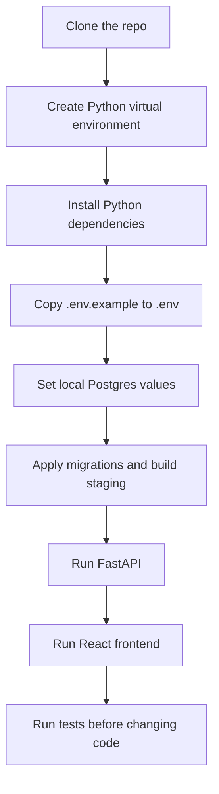

# Local Development

This guide is the practical developer-experience path for running, checking, and
debugging UPL Match Intelligence on a local machine.

Use [START_HERE.md](START_HERE.md) for project orientation and
[DOCUMENTATION_MAP.md](DOCUMENTATION_MAP.md) when you need to find a deeper
reference doc.

## First 30 Minutes

This is the shortest useful path for a new developer.



Recommended PowerShell flow:

```powershell
py -m venv .venv
.venv\Scripts\python.exe -m pip install -r requirements.txt
Copy-Item .env.example .env
Copy-Item frontend\.env.example frontend\.env
```

Then edit `.env` with local Postgres values:

```text
POSTGRES_HOST
POSTGRES_PORT
POSTGRES_DB
POSTGRES_USER
POSTGRES_PASSWORD
POSTGRES_SSLMODE
ALLOWED_ORIGINS
```

For local frontend development, `frontend/.env` should normally contain:

```text
VITE_API_BASE_URL=http://127.0.0.1:8000
```

## Common Commands

Use `.venv\Scripts\python.exe` when the local virtual environment exists.

| Task | Command |
|------|---------|
| Install Python dependencies | `.venv\Scripts\python.exe -m pip install -r requirements.txt` |
| Install API-only dependencies | `.venv\Scripts\python.exe -m pip install -r requirements-api.txt` |
| Install automation dependencies | `.venv\Scripts\python.exe -m pip install -r requirements-automation.txt` |
| Apply database migrations | `.venv\Scripts\python.exe scripts\data_platform\apply_db_migrations.py` |
| Load raw CSVs into Postgres | `.venv\Scripts\python.exe scripts\data_platform\load_raw_to_postgres.py` |
| Verify raw Postgres counts | `.venv\Scripts\python.exe scripts\data_platform\verify_raw_postgres_counts.py` |
| Build staging tables | `.venv\Scripts\python.exe scripts\data_platform\build_staging_from_raw.py` |
| Verify staging outputs | `.venv\Scripts\python.exe scripts\data_platform\verify_staging_outputs.py` |
| Refresh current season safely | `.venv\Scripts\python.exe scripts\data_platform\update_hosted_data.py --season-scope current --run-type routine-refresh` |
| Run Python tests | `.venv\Scripts\python.exe -m pytest` |
| Run FastAPI locally | `.venv\Scripts\python.exe -m uvicorn api.main:app --reload` |
| Install frontend dependencies | `cd frontend` then `npm install` |
| Run frontend dev server | `cd frontend` then `npm run dev` |
| Build frontend | `cd frontend` then `npm run build` |
| Preview frontend build | `cd frontend` then `npm run preview` |

## Local App Flow

Run the backend first:

```powershell
.venv\Scripts\python.exe -m uvicorn api.main:app --reload
```

Then open:

```text
http://127.0.0.1:8000/docs
```

In a second terminal, run the frontend:

```powershell
cd frontend
npm install
npm run dev
```

Then open:

```text
http://127.0.0.1:5173
```

The frontend should call the backend at:

```text
http://127.0.0.1:8000
```

## What Can Run Without Postgres?

Some checks do not need a live database:

- many unit tests around parsing and orchestration helpers
- `npm run build`
- frontend static type/build checks
- documentation edits and link checks

These usually need Postgres settings and reachable tables:

- `GET /health`
- most API endpoints
- raw count verification
- staging rebuilds
- staging output verification
- current-season refresh in full mode

If a command fails because Postgres is not configured, first check `.env` and
then check whether your local database exists.

## What To Run After Each Change

Use this table to avoid guessing.

| Change type | Minimum useful verification |
|-------------|-----------------------------|
| Documentation only | Read the changed doc and run a markdown-link check if links changed. |
| Python parsing or helper logic | `.venv\Scripts\python.exe -m pytest` |
| Scraper or raw-loading behavior | Relevant pytest tests, then `verify_raw_postgres_counts.py` if data changed. |
| Staging or validation logic | Relevant pytest tests, then `build_staging_from_raw.py` and `verify_staging_outputs.py`. |
| Current-season automation | Relevant pytest tests, then `update_hosted_data.py --season-scope current --run-type routine-refresh` for routine mode. |
| FastAPI route or schema | `.venv\Scripts\python.exe -m pytest`, run `uvicorn`, then check `/docs` and the affected endpoint. |
| React frontend | `cd frontend`, then `npm run build`; run the dev server for visual checks. |
| API response shape used by React | Verify the endpoint and run `npm run build`. |
| Deployment config | Check the local build command and the relevant deployment runbook before changing hosted settings. |

## Local Troubleshooting

### Python command cannot import project modules

Run commands from the repository root:

```text
C:\Personal Code Projects\upl-goal-timing
```

Prefer:

```powershell
.venv\Scripts\python.exe -m pytest
```

instead of relying on whichever `python` happens to be first on `PATH`.

### `ModuleNotFoundError: No module named 'fastapi'`

The virtual environment probably does not have the API dependencies installed.
Run:

```powershell
.venv\Scripts\python.exe -m pip install -r requirements.txt
```

### Postgres connection fails

Check these first:

- `.env` exists.
- `.env` has the correct `POSTGRES_*` values.
- the database named by `POSTGRES_DB` exists.
- `POSTGRES_SSLMODE` is appropriate for local or hosted Postgres.
- the database user has permission to read the schemas used by the command.

For hosted Supabase pooler connections, usernames may need the project-reference
suffix, such as:

```text
upl_actions_loader.<project-ref>
```

The role inside Postgres is still normally just:

```text
upl_actions_loader
```

### FastAPI starts but the frontend says the API is offline

Check:

- FastAPI is running at `http://127.0.0.1:8000`.
- `frontend/.env` has `VITE_API_BASE_URL=http://127.0.0.1:8000`.
- `ALLOWED_ORIGINS` in `.env` includes `http://127.0.0.1:5173`.
- after changing `frontend/.env`, restart `npm run dev`.

For hosted deployments, browser privacy extensions can block the Render API and
surface as `net::ERR_BLOCKED_BY_CLIENT`. Verify in a private or guest profile
before changing deployment settings.

### `npm run dev` or `npm run build` fails

From the repository root:

```powershell
cd frontend
npm install
npm run build
```

If the build still fails, read the TypeScript error first. Most frontend build
failures are caused by changed response types, missing fields, or import paths.

### Current-season refresh asks for too much database permission

Routine refreshes should not need admin migration privileges. Use:

```powershell
.venv\Scripts\python.exe scripts\data_platform\update_hosted_data.py --season-scope current --run-type routine-refresh
```

Schema changes belong to an admin/migration path. See
[OPERATIONS.md](OPERATIONS.md) and
[PHASE5_AUTOMATION.md](PHASE5_AUTOMATION.md).

## Where To Go Next

- [OPERATIONS.md](OPERATIONS.md) for logs, validation, run summaries, and
  escalation.
- [FEATURE_PROMOTION_WORKFLOW.md](FEATURE_PROMOTION_WORKFLOW.md) for notebook
  research promotion.
- [FRONTEND_UX_REQUESTS.md](FRONTEND_UX_REQUESTS.md) for planned UI/UX work.
- [PHASE7_DEPLOYMENT_RUNBOOK.md](PHASE7_DEPLOYMENT_RUNBOOK.md) for hosted
  deployment setup and browser troubleshooting.
