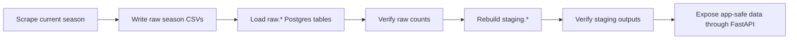

# Operations

This guide explains how routine data operations should be observed, tested, and
escalated after the initial launch build.

It belongs to the **Data Reliability & Operations** area described in
[START_HERE.md](START_HERE.md).

## What Operations Owns

Operations owns the path from source data refresh to app-safe database tables:



```text
scrape current season
  -> write raw season CSVs
  -> load raw.* Postgres tables
  -> verify raw counts
  -> rebuild staging.*
  -> verify staging outputs
  -> expose app-safe data through FastAPI
```

The normal orchestration command is:

```powershell
.venv\Scripts\python.exe scripts\data_platform\update_hosted_data.py --season-scope current --run-type routine-refresh
```

The wrapper skips migrations by default for routine refreshes because scheduled
operations should use a least-privilege loader role. Schema changes belong to a
separate admin/migration path.

Full-mode current-season updates use Postgres change detection by default. The
scraper reads existing `raw.*` rows first, keeps completed matches in the output
CSV without re-fetching their pages, and scrapes only:

- matches missing from Postgres
- unplayed or incomplete matches
- previously failed match URLs
- a small tail of recent completed matches, so late source corrections are
  still picked up

Use this only when you intentionally need a whole-season scrape:

```powershell
.venv\Scripts\python.exe scripts\data_platform\update_hosted_data.py --season-scope current --run-type routine-refresh --force-full-scrape
```

Artifact-only runs do not use Postgres change detection because they may run
without database credentials.

## Local Versus Hosted Operations Sync

Do not put hosted Supabase credentials in the local repository. The sync check
uses GitHub Actions logs as the hosted evidence and local operations summaries
as the local evidence.

The practical question is:

```text
After hosted GitHub Actions refreshes Supabase, did the equivalent local run
produce the same loaded raw counts, staging row counts, verification status, and
remaining failed-match count?
```

Run a local mirror check after a hosted workflow run:

```powershell
.venv\Scripts\python.exe scripts\data_platform\verify_operations_log_sync.py --season 2025-26 --latest-github-run --run-local-update
```

That command:

1. Finds the latest successful hosted GitHub Actions run for the season through
   the GitHub CLI.
2. Runs the local current-season update with `--skip-migrations`.
3. Compares hosted log evidence with the newest local
   `outputs/automation/<season>/*_run_summary.json`.
4. Writes a JSON sync report under `outputs/sync/`.
5. Exits with an error if loaded raw counts, staging counts, verification
   status, or remaining failed matches differ.

The command requires the GitHub CLI to be authenticated locally:

```powershell
gh auth login
```

If you already downloaded a hosted job log, compare from the file instead:

```powershell
.venv\Scripts\python.exe scripts\data_platform\verify_operations_log_sync.py --season 2025-26 --hosted-log path\to\github-job.log
```

Raw CSV artifact row-count differences are warnings by default because loaded
raw rows and staging rows are the database-safe sync signal. Use
`--strict-artifacts` if raw file row counts should also fail the sync check.

If the report says `out_of_sync`, escalate for investigation before assuming
the local and hosted systems are equivalent. The usual next checks are:

- Hosted row counts are behind: rerun the GitHub Actions season refresh.
- Local row counts are behind: rerun the local mirror update.
- Loaded raw counts match but staging counts differ: rebuild staging on the
  stale target.
- Verification status differs: inspect the relevant `verify_*` step logs.

## Logs And Run Summaries

Each operations run writes step logs under:

```text
outputs/automation/<season>/
```

Typical step logs include:

```text
<timestamp>_scrape_current_season.log
<timestamp>_load_raw_to_postgres.log
<timestamp>_verify_raw_postgres_counts.log
<timestamp>_build_staging_from_raw.log
<timestamp>_verify_staging_outputs.log
<timestamp>_run_summary.json
```

The step logs answer: **what happened inside this stage?**

The JSON run summary answers: **what was the final operational state?**

The run summary records:

- season
- mode
- source refresh behavior
- migration behavior
- raw verification status
- staging rebuild status
- staging verification status
- remaining failed matches
- raw CSV row counts
- raw loader row counts
- step-log paths

In GitHub Actions, upload both the raw files and `outputs/automation/` logs as
artifacts. A failed database step can still leave useful scraped files and logs
for debugging.

The GitHub Actions workflow runs Python with unbuffered output so long-running
steps stream progress while they run. The staging rebuild should print
checkpoints for reading raw tables, transforming rows, validation, deleting old
season rows, writing each staging table, and recording the validation run. If a
staging rebuild log is empty or stops at one checkpoint, treat that checkpoint as
the first place to investigate.

## Severity Ladder

Use this severity language consistently:

```text
INFO    Normal progress, such as loaded row counts.
WARNING Odd or incomplete, but not blocking.
ERROR   A stage failed or data quality is unsafe.
FATAL   The run cannot continue.
```

Examples:

- `INFO`: loaded 199 matches for the season.
- `WARNING`: a few match pages still need retry after a source timeout.
- `WARNING`: raw season CSVs contain cross-season spill rows that were skipped
  during loading, while valid in-season CSV counts still match Postgres.
- `ERROR`: raw CSV counts do not match loaded Postgres row counts.
- `FATAL`: Postgres cannot be reached, or required credentials are missing.

## Escalation Ladder

Use this operational ladder:

```text
Level 0: Record only
Level 1: Warn in logs or summaries
Level 2: Record a validation issue
Level 3: Fail the automation run
Level 4: Require manual/admin intervention
```

Do not fail the whole pipeline for every source-data imperfection. Football
source pages can be incomplete. The key question is whether the public app would
publish structurally broken or misleading data.

Escalate to a failed run when:

- a required stage exits with an error
- raw loaded counts disagree with season CSV counts
- staging verification reports error-level validation issues
- the staging rebuild records error-level validation issues before table writes
- remaining failed matches should block this specific run and
  `--fail-on-remaining-failed-matches` was requested

Escalate to manual/admin intervention when:

- routine automation needs schema-changing permissions
- a migration must be applied
- a database role or permission template must be changed
- secrets, passwords, or admin credentials may have been exposed

## Tests

The first unit-test foundation focuses on pure, high-risk logic that can break
football metrics without needing a live database:

- event-minute parsing
- event type and label normalization
- team-name normalization
- goal-type interpretation from minute annotations
- operations log-summary parsing
- JSON run-summary generation

Run the tests with:

```powershell
.venv\Scripts\python.exe -m pytest
```

These tests do not replace staging validation. They answer different questions:

```text
Unit tests: does our code behave correctly on known examples?
Validation: does today's real UPL data look safe and coherent?
```

## First Debugging Checks

When a routine update fails, check in this order:

1. Open the GitHub Actions job summary or local terminal output.
2. Open `outputs/automation/<season>/<timestamp>_run_summary.json`.
3. Open the log for the failed step.
4. If scraping failed, inspect the failed-match manifest in `data/raw/<season>/`.
5. If raw verification failed, compare raw CSV row counts with Postgres counts.
6. If staging verification failed, inspect `staging.validation_issues`.
7. If permissions failed, confirm the job is using the correct routine or admin
   database role for the task.

The staging rebuild validates the prepared tables before writing them. If
error-level validation issues are found, it records those issues and the
validation run, skips staging table writes, and exits with an error. This keeps
unsafe child rows from crashing into foreign key constraints before the useful
diagnostic evidence is saved.

## Source Anomalies

Keep source anomalies in `raw.*` so the original scrape remains auditable. In
`staging.matches`, rows with clearly impossible season dates are marked with
`is_source_anomaly = true` and a `source_anomaly_reason` instead of being
deleted. Public API aggregates should use app-safe rows only, so a stale source
fixture does not distort season date ranges, match counts, or dashboard totals.

Example: a `2019_20` source row dated in May 2021 is preserved for investigation
but excluded from the league overview.

For public metrics, **actual goals** means timeline goal events from
`staging.events`, not scoreline totals from `staging.matches`. Scoreline goals
remain available internally as a separate comparison signal because
administrative results and forfeits can show a 3-0 scoreline without matching
goal events in the source timeline. The staging validator records
`scoreline_timeline_goal_mismatch` warnings so these edge cases are visible
before analysis or product work depends on the season totals.

Staging also carries `staging.matches.is_forfeit` for matches whose source text
clearly describes forfeiture, walkover, or a team failing to turn up. Use that
flag to separate administrative outcomes from normal played matches in future
analysis.

Cross-season spill rows during raw count verification are warning-level when
`csv_valid` equals the Postgres count. They mean the source calendar included
rows outside the requested season folder, and the loader skipped them as
designed. Escalate only if the valid in-season count disagrees with Postgres or
the spill pattern looks surprising enough to suggest a scraper/source change.
The raw verifier prints a source-season breakdown, such as `2025/26=12`, so the
log shows where the leaked rows came from.

The scraper also filters rows by the requested season before writing raw CSVs.
That keeps new raw artifacts season-scoped even when the official calendar
temporarily leaks match URLs from another season. Older raw folders may still
contain historical spill rows until they are refreshed; the raw loader and raw
verifier remain defensive so those old artifacts do not contaminate Postgres.

When a scrape and raw load already succeeded, rerun the GitHub workflow with
`run_type=rebuild-from-existing-raw` to debug staging and analytics against the
existing raw database rows without fetching match pages again. Use
`season_scope=all` after hosted admin SQL changes when every season needs the
same staging/analytics rebuild. Do not run multiple full refresh workflows for
the same season at the same time because concurrent staging rebuilds can create
avoidable lock contention.
