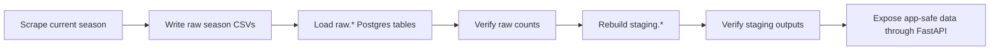

# Operations

This is the source of truth for Data Reliability & Operations work in the UPL
Match Intelligence repo and the UPL Lens production pipeline.

It combines:

- routine data-refresh operations
- GitHub Actions automation behavior
- hosted deployment runbook details
- logs, validation, and escalation rules
- hosted troubleshooting and free-tier caveats

Use this with [START_HERE.md](START_HERE.md),
[PROJECT_ROADMAP.md](PROJECT_ROADMAP.md), and
[diagram_collection.md](diagram_collection.md).

## What Operations Owns

Operations owns the path from source refresh to app-safe tables:



The normal orchestration command is:

```powershell
.venv\Scripts\python.exe scripts\data_platform\update_hosted_data.py --season-scope current --run-type routine-refresh
```

Routine refreshes skip migrations by default because scheduled jobs should use a
least-privilege loader role. Schema changes belong to a separate admin path.

## Routine Versus Admin Paths

Keep these two modes separate:

| Path | Purpose | Permissions |
|------|---------|-------------|
| Routine refresh | Update raw, staging, and analytics-safe data | least-privilege loader role |
| Admin migration work | Apply schema or permission changes | admin-capable credential |

Routine weekly refresh defaults:

```text
season_scope=current
run_type=routine-refresh
apply_migrations=false
use_cache=false
force_full_scrape=false
```

Equivalent local command:

```powershell
.venv\Scripts\python.exe scripts\data_platform\update_hosted_data.py --season-scope current --run-type routine-refresh
```

Use `--force-full-scrape` only when you intentionally need a whole-season
scrape. Full mode otherwise uses Postgres change detection so completed matches
do not get re-fetched unnecessarily.

## Hosted Workflow Modes

The GitHub workflow intentionally exposes operator-level choices.

| Input | Normal value | Meaning |
|------|--------------|---------|
| `season_scope` | `current` | Use `current`, `all`, or `custom`. |
| `season` | `2025-26` | Only used when `season_scope=custom`; pass comma-separated seasons. |
| `run_type` | `routine-refresh` | Use `routine-refresh`, `rebuild-from-existing-raw`, or `artifact-only`. |
| `apply_migrations` | `false` | Apply schema migrations before data work. |
| `use_cache` | `false` | Allow cached scraper HTML or checkpoints. |
| `force_full_scrape` | `false` | Scrape every calendar match instead of using change detection. |

### Rebuild All Seasons After Admin SQL

When admin SQL has already been handled separately, the safest hosted catch-up
run is:

```text
season_scope=all
run_type=rebuild-from-existing-raw
apply_migrations=false
use_cache=false
force_full_scrape=false
```

This rebuilds `staging.*` and refreshes analytics from existing `raw.*` tables
without scraping the live site or reloading raw rows.

### Admin Migration Run

Use an admin-capable credential only when the schema changed and migrations need
to run:

```text
season_scope=current
run_type=routine-refresh
apply_migrations=true
use_cache=false
force_full_scrape=false
```

After the migration setup is complete, switch secrets back to the least-
privilege loader role.

## Local Versus Hosted Operations Sync

Do not put hosted Supabase credentials in the repository. Use GitHub Actions
logs as hosted evidence and local operations summaries as local evidence.

Mirror-check command:

```powershell
.venv\Scripts\python.exe scripts\data_platform\verify_operations_log_sync.py --season 2025-26 --latest-github-run --run-local-update
```

That command:

1. finds the latest successful hosted GitHub Actions run for the season
2. runs the local current-season update with `--skip-migrations`
3. compares hosted log evidence with the newest local run summary
4. writes a JSON sync report under `outputs/sync/`
5. exits with an error if loaded raw counts, staging counts, verification
   status, or remaining failed matches differ

If the report says `out_of_sync`, investigate before assuming the local and
hosted systems are equivalent.

## Logs And Run Summaries

Each operations run writes step logs under:

```text
outputs/automation/<season>/
```

Typical files:

```text
<timestamp>_scrape_current_season.log
<timestamp>_load_raw_to_postgres.log
<timestamp>_verify_raw_postgres_counts.log
<timestamp>_build_staging_from_raw.log
<timestamp>_verify_staging_outputs.log
<timestamp>_run_summary.json
```

The step logs answer: what happened inside this stage?

The JSON run summary answers: what was the final operational state?

The run summary should record:

- season
- mode
- source refresh behavior
- migration behavior
- raw verification status
- staging rebuild status
- staging verification status
- remaining failed matches
- raw CSV row counts
- raw loader row counts
- step-log paths

In GitHub Actions, upload both raw files and `outputs/automation/` logs as
artifacts even when a run fails.

## Severity Ladder

Use this severity language consistently:

```text
INFO    Normal progress, such as loaded row counts.
WARNING Odd or incomplete, but not blocking.
ERROR   A stage failed or data quality is unsafe.
FATAL   The run cannot continue.
```

## Escalation Ladder

Use this ladder:

```text
Level 0: Record only
Level 1: Warn in logs or summaries
Level 2: Record a validation issue
Level 3: Fail the automation run
Level 4: Require manual/admin intervention
```

Escalate to a failed run when:

- a required stage exits with an error
- raw loaded counts disagree with season CSV counts
- staging verification reports error-level issues
- the staging rebuild records error-level validation issues before table writes
- `--fail-on-remaining-failed-matches` was requested and remaining failures
  should block the run

Escalate to manual or admin intervention when:

- routine automation needs schema-changing permissions
- a migration must be applied
- a database role or permission template must be changed
- secrets, passwords, or admin credentials may have been exposed

## Tests

The first unit-test foundation focuses on pure, high-risk logic that can break
football metrics without needing a live database:

- event-minute parsing
- event type and label normalization
- team-name normalization
- goal-type interpretation from minute annotations
- operations log-summary parsing
- JSON run-summary generation

Run tests with:

```powershell
.venv\Scripts\python.exe -m pytest
```

Unit tests do not replace staging validation:

```text
Unit tests = does code behave correctly on known examples?
Validation = does today's real UPL data look safe and coherent?
```

## First Debugging Checks

When a routine update fails, check in this order:

1. Open the GitHub Actions job summary or local terminal output.
2. Open the newest `outputs/automation/<season>/<timestamp>_run_summary.json`.
3. Open the log for the failed step.
4. If scraping failed, inspect the failed-match manifest in `data/raw/<season>/`.
5. If raw verification failed, compare raw CSV row counts with Postgres counts.
6. If staging verification failed, inspect the validation issue output.
7. If permissions failed, confirm the correct routine or admin database role is
   being used.

## Source Anomalies And Trust Rules

Keep source anomalies in `raw.*` so the original scrape remains auditable.

In `staging.matches`, rows with clearly impossible season dates should be
flagged with `is_source_anomaly = true` and a `source_anomaly_reason` instead
of being deleted. Public API aggregates should use app-safe rows only.

For public metrics, actual goals means timeline goal events from
`staging.events`, not scoreline totals from `staging.matches`. Scoreline goals
remain useful as a comparison signal because forfeits or administrative results
can show a 3-0 scoreline without matching timeline goal events.

Cross-season spill rows during raw verification are warning-level when the valid
in-season count still matches Postgres. Escalate only if the valid season count
disagrees or the spill pattern suggests a scraper or source-site change.

## Hosted Deployment Shape

Current recommended hosted shape:

```text
Frontend: Cloudflare Pages first choice, Vercel acceptable alternative
Backend: Render FastAPI service
Database: Supabase Postgres
Automation: GitHub Actions
```

The deployed request path remains:

```text
React UI -> FastAPI endpoint -> Supabase Postgres query/view -> JSON -> chart/table
```

## Hosted Roles And Secrets

Expected database roles:

- admin or owner role for setup and migrations only
- `upl_actions_loader` for scheduled refreshes
- `upl_api_reader` for the deployed FastAPI backend
- optional read-only research role for notebooks

Typical hosted environment variables:

```text
POSTGRES_HOST
POSTGRES_PORT
POSTGRES_DB
POSTGRES_USER
POSTGRES_PASSWORD
POSTGRES_SSLMODE
ALLOWED_ORIGINS
```

Frontend host variable:

```text
VITE_API_BASE_URL=https://<hosted-api-domain>
```

For Supabase pooler connections, usernames may need the project-reference
suffix, such as `upl_actions_loader.<project-ref>` or
`upl_api_reader.<project-ref>`.

Do not commit real passwords, connection strings, or copied hosted secrets.

## Hosted Deployment Order

Deploy in this order:

1. confirm Supabase roles and connection details
2. deploy FastAPI to Render
3. confirm the hosted API can reach Supabase
4. deploy the React frontend
5. add the final frontend URL to API `ALLOWED_ORIGINS`
6. verify the public app end to end
7. attach a custom domain later, after the free-subdomain deployment works

Do not deploy the frontend first. It needs the hosted API URL for
`VITE_API_BASE_URL`.

## Current Hosted Endpoints

Current public URLs:

```text
Frontend: https://upl-match-intelligence.pages.dev
Backend: https://upl-match-intelligence-api.onrender.com
Liveness: https://upl-match-intelligence-api.onrender.com/health/live
Readiness: https://upl-match-intelligence-api.onrender.com/health
```

Useful hosted checks:

```text
GET /health/live
GET /health
GET /seasons
GET /insights/goal-timing?season=2025_26
```

Meaning:

- `/health/live` proves the FastAPI process is running
- `/health` proves the API can reach Supabase
- `/seasons` proves the API can read staging match data
- `/insights/goal-timing` proves the promoted research slice works end to end

## Browser Troubleshooting

If the public frontend loads but shows the API as offline, first open:

```text
https://upl-match-intelligence-api.onrender.com/health/live
```

If that URL works but the frontend shows:

```text
net::ERR_BLOCKED_BY_CLIENT
```

the request is being blocked by the browser, an extension, DNS filtering,
antivirus web protection, or another client-side filter. That is different from
a CORS failure.

Useful checks:

- try a private or guest profile
- disable ad blockers and privacy extensions
- test Ghostery first if it is installed
- clear site data for the frontend and backend domains
- add allow-list exceptions for both hosted URLs

If one browser blocks the request but another works, keep the deployment marked
healthy and treat it as a local browser configuration issue.

## Known Free-Tier Tradeoffs

- Render services can sleep when idle, so the first API request may be slow.
- Supabase free projects have storage and inactivity limits.
- The static frontend should still load quickly because hosting is separate from
  the sleeping API.
- This is a polished zero-budget deployment, not final production
  infrastructure.

## Successful Run Checklist

A healthy routine run should show:

- scraper finished the target season refresh
- migrations were skipped for routine mode
- `load_raw_to_postgres` finished
- `verify_raw_postgres_counts` finished
- `build_staging_from_raw` finished
- `verify_staging_outputs` finished without error-level issues
- the final operations summary printed row counts and log paths
- `<timestamp>_run_summary.json` was written under `outputs/automation/<season>/`
