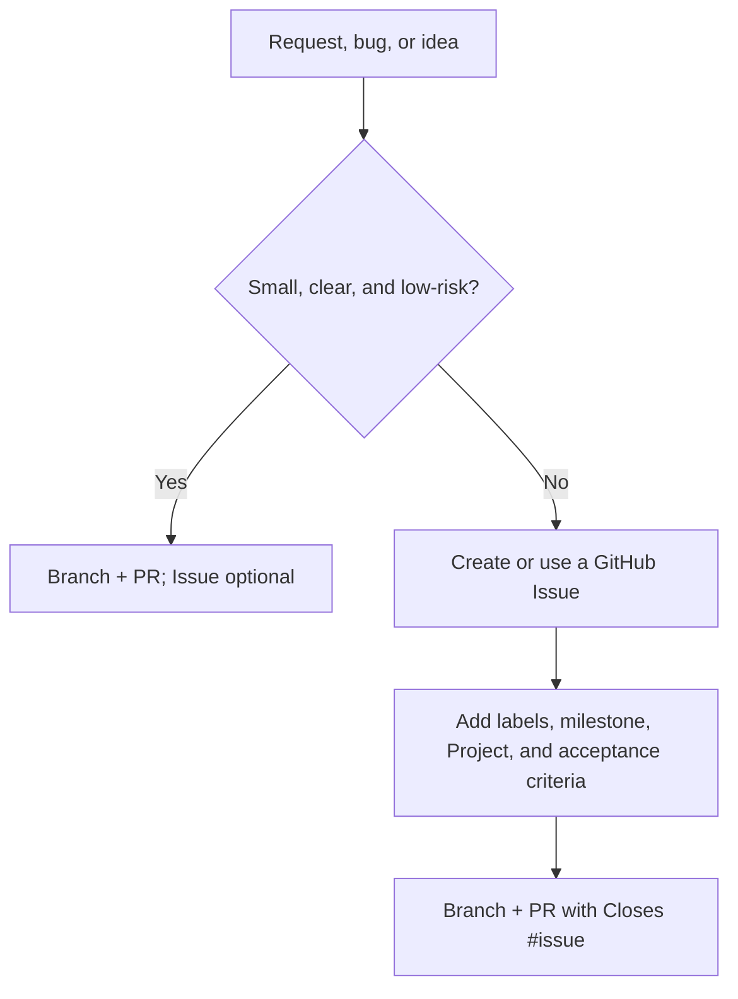

# UPL Lens Roadmap

## Purpose

This document is the working plan for evolving **UPL Lens** from a goal-timing
analysis into a full-stack Uganda Premier League data platform.

The initial launch build moved through a set of phases so each layer could be
created in order. That launch foundation now exists at a basic public-product
level. Future work should be planned through four continuous development areas,
not through the old phase sequence.

The goal is not to copy the official UPL website. The official site provides
match pages and source data. This project should turn that data into searchable,
modeled, and meaningful football intelligence.

The product identity and positioning rules live in
[PRODUCT_STRATEGY.md](PRODUCT_STRATEGY.md). Use that document when deciding
what the public app should feel like, what it should not become, which audience
comes first, and how product strategy should guide technical work.

The final shape should demonstrate:

- Web scraping and incremental data collection.
- Data cleaning, validation, and modeling.
- Postgres database design.
- FastAPI backend development.
- React frontend development.
- Scheduled automation with GitHub Actions.
- Notebook-based research that can be promoted into product features.

## North Star

Build an open-source UPL data observatory where users can explore matches,
teams, players, discipline, goal timing, lineups, officials, and match trends
across seasons.

**UPL Lens** is an independent statistical observatory
for people who want to understand the league beyond fixtures, results, and
tables. It should lead with curated insight, then offer deeper analytical
drilldowns. The former UPL Match Intelligence name is historical context only.

The project should support two audiences:

- **Analytical users** who want to understand patterns in the league.
- **Portfolio/recruiting reviewers** who want to see clear engineering range:
  data engineering, backend, frontend, automation, and analytical storytelling.

## Core Product Question

What can this project reveal about the Uganda Premier League that individual
match pages cannot?

Examples:

- Which teams are most dangerous after halftime?
- Which teams concede late most often?
- Which teams are most disciplined or card-prone?
- How do yellow and red cards affect match outcomes?
- Which players are regular starters, impact substitutes, or frequent scorers?
- Which officials produce high-card or high-penalty matches?
- Which teams have strong home advantage?
- Which matches had the most dramatic timelines?
- How has the league changed season by season?

## GitHub-Native Work Management

UPL Lens now uses GitHub as the active work-management layer while the seven
docs remain the durable source of system knowledge.

```text
Docs explain the system.
Issues move the work.
Branches isolate the work.
Pull Requests review the work.
Projects show workflow state.
Milestones define release goals.
Releases record what shipped.
Agents work from Issues when available.
The owner approves closure and release.
```

Create a GitHub Issue when work exceeds a small quick fix, requires planning,
affects documentation, changes product behavior, introduces functionality, fixes
a defect, or needs research. Use `.github/ISSUE_TEMPLATE/` for new Issues. The
initial seed Issues have been created in GitHub, with reusable local drafts kept
in `.github/ISSUE_DRAFTS/`.

### Project Pipeline

Use this simplified UPL Project pipeline:

```text
Inbox -> Research -> Ready -> In Progress -> Review / QA -> Done -> Released -> Parked
```

Project columns describe workflow state. They do not replace Issue bodies,
labels, acceptance criteria, or owner review.

### Branch And Pull Request Workflow

Meaningful work should not be pushed directly to `main`. Use an Issue-specific
branch and Pull Request:

```text
Issue -> branch -> work -> commit -> push branch -> Pull Request -> owner test/review -> merge
```

Use branch names that identify the worker and Issue:

```text
codex/issue-1-api-client-sync
codex/issue-8-red-card-research
humphrey/issue-3-trends-rebuild
```

Agents should open draft PRs by default unless the user explicitly asks for a
ready PR. PRs should link the Issue, summarize changes, list verification, call
out risks, and leave merge/release approval to the owner.

### Small Fix Rule

A small fix may skip a GitHub Issue, but it should still use a branch and PR if
it changes code, docs, config, deployment behavior, or other tracked project
files.

Small fixes usually:

- take less than about 15 minutes
- touch one or two files
- have an obvious cause and acceptance condition
- do not need a product, research, API, data, or deployment decision
- do not change public data interpretation, schema, secrets, or release safety

Examples include typo fixes, broken links, tiny copy corrections, obvious doc
command corrections, or a one-line config note. Create or use an Issue instead
when work is unclear, multi-step, risky, useful for another agent to resume,
belongs to a milestone, changes API/data/frontend behavior, or may create
follow-up work.

Use this beginner decision flow:



### When To Create An Issue

Create an Issue before coding when any of these are true:

- the task needs acceptance criteria or a checklist
- the work should appear on the Project board
- the work belongs to a milestone or release goal
- another agent or future session may need to resume it
- the task changes public product behavior, API shape, data interpretation, or
  deployment behavior
- the task needs research, notebook evidence, screenshots, stakeholder review,
  or caveat documentation
- the bug is not immediately reproducible or the cause is uncertain

If a user gives a direct request with no Issue, an agent may execute it as a
small fix only when it clearly meets the small-fix rule. Otherwise the agent
should create a draft Issue or ask whether to create one before implementation.

### Draft PR Default

Draft PRs are the safe default for humans and agents while work is still being
assembled. A PR should move from draft to ready for review only after:

- the linked Issue checklist and acceptance criteria are complete
- the PR template is filled in
- relevant verification evidence is recorded
- out-of-scope follow-up is captured in a PR comment or follow-up Issue

### Pull Request Testing Before Merge

The owner should test PRs before merge, using the lightest evidence that matches
the risk of the change.

Common testing paths:

- Review the PR diff, linked Issue, checklist, labels, milestone, and Project
  state.
- For local testing, fetch the branch, switch to it, run the relevant commands,
  and inspect the affected app surface.
- For frontend PRs, use the Cloudflare Pages preview deployment when available,
  then record the preview URL and browser notes in the PR.
- For API or data PRs, run the relevant test/script/endpoint check and record
  the command or endpoint evidence.
- For docs-only PRs, read the changed section and run link or formatting checks
  when links changed.

Useful local commands:

```powershell
git fetch origin
git switch <branch-name>
.venv\Scripts\python.exe -m pytest
cd frontend
npm run build
npm run dev
```

Do not merge a PR just because it builds. Merge when the Issue acceptance
criteria are met and the owner has reviewed the result.

### Branch Cleanup And Long-Lived Branches

Use short-lived branches for normal work and delete them after merge. GitHub's
"automatically delete head branches" setting is recommended for this repo.

Avoid fixed long-lived branches such as `frontend-work`, `agent-work`, or
`research-work` for routine development. They become mini-main branches and make
it harder to know what is safe. Keep long-lived branches only for deliberate
experiments that the owner explicitly wants to preserve.

### Pull Request Automation

The lightweight GitHub Actions gate in `.github/workflows/pr-checks.yml` runs
low-noise checks that match the current repo maturity:

- frontend build: `cd frontend && npm run build`
- Python tests: `.venv\Scripts\python.exe -m pytest` locally, or
  `python -m pytest` in CI after installing `requirements.txt`
- optional documentation/link checks after the doc workflow settles

CI should support owner review, not replace it. A green check means the basics
passed; it does not mean the product decision, research caveat, or browser
experience is automatically correct.

### Pull Request Metadata And Issue Closure

When a PR is created from an Issue, it should carry the same planning metadata
so work remains visible in GitHub views:

- Copy relevant Issue labels, especially area, type, and priority labels.
- Add the PR to the same GitHub Project as the Issue.
- Assign the same milestone when the Issue has one.
- Set the PR status label to `status: needs-review` when it is ready for owner
  review, and `status: validated` only after verification evidence supports it.
- Use `Closes #<issue-number>` in the PR body so GitHub closes the Issue when
  the reviewed PR is merged.

A PR should not be submitted for review until the Issue checklist and acceptance
criteria are complete. If useful follow-up work is discovered outside the Issue
scope, leave it as a PR comment or create a follow-up Issue instead of expanding
the PR silently.

### Label Taxonomy

Use these labels for filtering and agent handoffs:

| Group | Labels |
|---|---|
| Area | `area: data-reliability`, `area: research-intelligence`, `area: product-experience`, `area: developer-docs` |
| Type | `type: bug`, `type: feature`, `type: research`, `type: documentation`, `type: api-contract`, `type: release` |
| Priority | `priority: critical`, `priority: high`, `priority: medium`, `priority: low` |
| Status | `status: needs-triage`, `status: ready`, `status: blocked`, `status: needs-review`, `status: validated` |

### Initial Milestones

- `v0.2 Intelligence API Client Sync`
- `v0.3 Trends + Team Intelligence`
- `v0.4 Match + Player Intelligence`
- `v0.5 Feature 2 Discipline Research`
- `v1.0 Public UPL Lens Release`

Milestones are release goals, not arbitrary deadlines.

### Definition Of Ready

An Issue is ready to work when the objective, context, scope, labels, related
docs/files, and acceptance criteria are clear enough for a human or AI agent to
continue without reconstructing the discussion from chat history.

### Definition Of Done

An Issue is done when its acceptance criteria are met, relevant verification is
recorded, documentation is updated where needed, follow-up Issues are created
for remaining work, a PR has been reviewed/merged when code or docs changed,
and the owner accepts closure. Agents may recommend closure, but the owner
closes important Issues and approves releases.

### Agent Coworker Model

Use Issues to give agents bounded coworker roles:

- **Research Analyst Agent**: research-intelligence Issues; notebooks, SQL,
  caveats, and promotion recommendations.
- **Data Reliability Agent**: data-reliability Issues; scraper, staging,
  validation, automation, and hosted health.
- **Product Experience Agent**: product-experience Issues; API-facing React
  pages, charts, UI states, and browser verification.
- **Docs Steward Agent**: developer-docs Issues; documentation, navigation,
  issue hygiene, and agent instructions.
- **QA / Release Agent**: release Issues; acceptance criteria, verification,
  known limitations, and release notes.

## Intelligence-Layer Frontend Maturation

This June/July phase moved UPL Lens from a pilot dashboard into the v1.0 public
release foundation. It is no longer the active build-order list.

### Completed Foundation

- Backend intelligence endpoints exist for trends, overview intelligence, match
  triage, team profiles, player leaderboards, and extended match/player detail
  payloads.
- `frontend/src/api/client.ts` and `frontend/src/api/types.ts` expose the current
  frontend-facing contract.
- Shared intelligence primitives exist for mini charts, comparison bars,
  scatter plots, timeline rails, score progression, form strips, signal chips,
  and data-quality notes.
- Trends, Teams, Team Detail, Matches, Match Detail, Players, Player Detail,
  Insights, Overview, and About/Methodology have merged intelligence-layer
  routes.
- Cross-route QA guidance now lives in
  [FRONTEND_DESIGN_SYSTEM.md](FRONTEND_DESIGN_SYSTEM.md) for future Product
  Experience PRs.

### Current v1.0 Release Focus

The current release lane is hardening and owner review, not another frontend
rebuild. Use GitHub Issues and PRs for live status. At the time of this
reconciliation, the open release-hardening items include:

- API proxy cache-header safety for credentialed bypasses, under review in PR
  #101.
- Hosted refresh observability artifacts, under review in PR #102.
- Routine refresh, admin migration, and full rebuild workflow-mode separation,
  tracked in Issue #64 and not yet shipped.

Do not document those pending items as merged behavior until their PRs land on
`main`.

### Next Product Experience Loop

After v1.0 release blockers are handled, Product Experience work should be
selected from owner QA findings, public usability gaps, or research-backed
feature promotion. The durable page roles, API contract, and launch acceptance
checks live in [FRONTEND_DESIGN_SYSTEM.md](FRONTEND_DESIGN_SYSTEM.md).

## Architecture Overview

The project should be split into three tracks.

### 1. Data Platform

Responsible for getting data from the source to trustworthy storage.

Responsibilities:

- Scrape UPL calendar and match pages.
- Persist raw scrape outputs.
- Normalize team, player, event, venue, official, and match data.
- Load data into Postgres.
- Run validation checks.
- Support incremental updates for the current season.
- Log failed or incomplete matches.

### 2. Research Lab

Responsible for discovery.

Responsibilities:

- Use notebooks for exploratory analysis.
- Test relationships and hypotheses.
- Create prototype charts.
- Document interesting findings.
- Decide which findings deserve promotion into the app.

Rule: notebooks are for research, not production serving.

### 3. Public Product

Responsible for user-facing exploration.

Responsibilities:

- Expose clean data through FastAPI.
- Present insights in a React app.
- Make team, player, match, season, event, and discipline data easier to browse.
- Turn validated notebook findings into polished dashboard features.

Preferred production flow:

```text
Scraper -> raw files/cache -> cleaning/modeling -> Postgres -> FastAPI -> React
```

Preferred user request flow:

```text
React component -> FastAPI route -> query/service layer -> Postgres -> JSON -> chart/table
```

## Continuous Development Areas

Use these four areas for new planning, review, and prioritization.

### 1. Data Reliability & Operations

Purpose: keep the data platform trustworthy from source scrape to public
deployment.

Owns:

- scraper reliability and source-site change handling
- raw files, cache behavior, and failed-match manifests
- Postgres migrations, schemas, indexes, and permissions
- raw-to-staging rebuilds
- validation checks and issue severity
- stage logs, run summaries, and workflow artifacts
- current-season automation through GitHub Actions
- deployment health, CORS, hosted database limits, and database roles
- unit tests around high-risk data parsing and pipeline orchestration

Current strengths:

- structured scraper outputs exist for matches, events, lineups, staff,
  officials, stats, and failed matches
- the scraper command remains stable while implementation modules live under
  `src/scraping/upl/`
- raw CSVs can load into Postgres idempotently
- staging tables rebuild from Postgres `raw.*` through the modular
  `src/db/staging/` package
- `analytics.team_season_summary` stores reusable team-season summaries after
  staging rebuilds
- validation runs and validation issues are stored in staging
- current-season automation exists locally and in GitHub Actions
- deployment uses hosted React, FastAPI, and Postgres services

Known weaknesses:

- source-site HTML changes can still break scraping
- validation coverage is useful but still early
- stage logs and run summaries should become more consistent
- unit tests are not yet a real safety net
- free-tier backend/database behavior can affect public reliability

Next useful work:

- add a small observability and test foundation
- make stage logs and run summaries more standardized
- add tests for event-minute parsing, event normalization, team-name
  normalization, staging validation rules, and automation flags
- keep routine automation separate from admin migration paths
- monitor hosted database size and failed-match patterns

Escalate when:

- the scraper cannot reach or parse source pages
- raw loaded counts disagree with source files
- staging validation finds structural errors
- the public API would serve misleading data
- routine automation requires admin database privileges
- credentials or secrets are exposed

### 2. Research & Football Intelligence

Purpose: turn UPL data into validated football insight instead of ungrounded
dashboard decoration.

Owns:

- feature notebooks
- research backlog and feature lifecycle notes in
  `docs/FEATURE_PROMOTION_WORKFLOW.md`
- research briefs and product plans
- metric definitions and source-data caveats
- feature registry status
- direct API query versus `analytics.*` view decisions
- promotion from notebook finding to API and React

Current strengths:

- Feature 1 goal timing is promoted into FastAPI and React
- feature templates and registry exist
- notebook data-access rules prefer cleaned Postgres `staging.*`
- analytics promotion rules exist for reusable metrics

Known weaknesses:

- only one insight has been promoted so far
- the next football feature needs research validation before UI work
- caveats need to stay visible when source data is incomplete

Next useful work:

- start Feature 2, likely discipline/card trends
- use `docs/FEATURE_PROMOTION_WORKFLOW.md` to compare candidate football
  questions before creating a feature package
- validate a second useful football question in a notebook
- decide whether the metric should use a direct API query or `analytics.*` view
- promote the validated metric into FastAPI and React

Escalate when:

- a proposed dashboard metric lacks a reproducible notebook, SQL query, or
  documented product plan
- a feature depends on raw data or CSVs without a clear reason
- the source data caveats are too large to present without explanation

### 3. Product Experience

Purpose: make the API and React app useful, understandable, and polished for
people exploring the league.

Owns:

- FastAPI routes and response models
- query/service functions under `src/api/`
- React pages, filters, charts, tables, and loading states
- frontend API client and response types
- browser-facing error handling for API offline states and free-tier cold starts
- product navigation and UI/UX quality
- frontend change requests, visual-system guidance, API contract notes, and
  approved frontend behavior in `docs/FRONTEND_DESIGN_SYSTEM.md`

Current strengths:

- FastAPI exposes seasons, overview, trends, matches, match intelligence, team
  profiles, player leaderboards, events, officials, health, and goal timing
  insight endpoints.
- route functions are thin and query logic is centralized under
  `src/api/query_services/`.
- React reads FastAPI JSON instead of CSV files, notebooks, or exported images.
- the frontend has a modular `AppShell`, page components, reusable product
  surfaces, and shared intelligence primitives.
- merged routes now cover Overview, Matches, Match Detail, Teams, Team Detail,
  Players, Player Detail, Insights, Trends, Goal Timing, and About/Methodology.
- the deployed app proves the full public request flow through Cloudflare Pages,
  the Pages `/api/*` proxy, Render FastAPI, and Supabase Postgres.
- cross-route QA guidance exists for hierarchy, imagery, navigation, state
  handling, data trust, and responsive/browser verification.

Known weaknesses:

- the public app still needs owner release QA across common desktop and mobile
  routes before v1.0 is accepted.
- discipline/card intelligence remains a research candidate, not a promoted
  insight or finished dashboard feature.
- some public polish work remains active in GitHub Issues and should not be
  treated as complete until reviewed and merged.
- free-tier backend/database behavior can still affect perceived reliability,
  so cache/proxy behavior and hosted health need continued attention.

Next useful work:

- finish v1.0 release-hardening PRs and record owner/browser QA evidence.
- keep Product Experience follow-up tied to GitHub Issues with route-specific
  acceptance criteria and cross-route QA notes.
- promote the next football insight only after notebook evidence and product
  planning support it.
- add or change API endpoints only when a real product surface needs the data.

Escalate when:

- React starts duplicating durable SQL or backend logic
- the frontend needs data that no API endpoint exposes cleanly
- API response changes can break the dashboard
- UI presentation makes incomplete data look certain
### 4. Developer Experience & Documentation

Purpose: keep the project readable, runnable, and teachable for a junior
developer, reviewer, future contributor, or AI agent.

Owns:

- onboarding and documentation navigation
- local setup instructions
- command guides and troubleshooting docs
- testing instructions
- beginner-readable explanations
- repo conventions in `AGENTS.md` and related guidance
- keeping docs aligned with actual commands and deployed behavior

Current strengths:

- the project has detailed docs for roadmap, automation, deployment, and feature
  promotion
- `docs/START_HERE.md` and `docs/LOCAL_DEVELOPMENT.md` give new readers a
  beginner-friendly entrypoint, a concise recent-history summary, and a
  runnable local setup and operations guide
- `docs/diagram_collection.md` gives maintainers and agents a visual overview
  of the codebase, data pipeline, database shape, API flow, and scraper
  lifecycle
- `AGENTS.md` captures repo-specific AI working rules
- README explains the live demo and core architecture

Known weaknesses:

- documentation became launch-history heavy
- there are still enough docs that repeated guidance can become stale
- phase-named docs are useful references, but should not become the current
  planning model again

Next useful work:

- use `docs/START_HERE.md` as the beginner entrypoint
- use `docs/LOCAL_DEVELOPMENT.md` for setup, command, verification, and local
  troubleshooting guidance
- use `docs/START_HERE.md` as the doc navigation hub
- maintain `docs/diagram_collection.md` when high-level codebase structure or
  known gaps change
- use `docs/LOCAL_DEVELOPMENT.md` for log, summary, test, and escalation rules
- keep README short and public-facing
- keep this roadmap as the planning map
- keep detailed automation/deployment/feature docs as references
- add or consolidate local development and operations guides when the current
  docs start repeating each other

Escalate when:

- docs give conflicting commands
- local setup depends on hidden machine state
- a new developer cannot tell which doc to read first
- a code path changes without corresponding documentation updates

## Logs, Tests, Validation, And Escalation

Logs, tests, validation, and escalation belong primarily to Data Reliability &
Operations, with documentation support from Developer Experience.

Use this distinction:

```text
Logs = what happened during a real run.
Tests = what should always be true when code changes.
Validation = whether the current real data is safe and coherent.
Escalation = what to do when logs, tests, or validation reveal risk.
```

Recommended log shape:

```text
outputs/automation/
  scrape.log
  raw-load.log
  raw-verify.log
  staging-build.log
  staging-verify.log
  run-summary.md or run-summary.json
```

Recommended severity ladder:

```text
INFO    Normal progress, such as loaded row counts.
WARNING Odd or incomplete, but not blocking.
ERROR   A stage failed or data quality is unsafe.
FATAL   The run cannot continue.
```

Recommended escalation ladder:

```text
Level 0: Record only
Level 1: Warn in logs or summaries
Level 2: Record a validation issue
Level 3: Fail the automation run
Level 4: Require manual/admin intervention
```

Initial test targets:

- event-minute parsing
- event normalization
- team-name normalization
- staging validation rules
- API response shapes
- automation mode and flag behavior

Do not fail the whole pipeline for every source-data imperfection. Do fail when
the app would publish structurally broken or misleading data.

## Current Data Assets

The current scraper collects structured per-match data into these tables:

- `matches`
- `events`
- `lineups`
- `staff`
- `officials`
- `stats`
- `failed_matches`

The older goal timing work is Feature 1 / the pilot project. It should stay
visible as the first proof that the platform can turn raw UPL match data into a
clear football insight. The new data expands the project beyond goals into team
behavior, discipline, players, officials, match stats, and lineups.

## Completed Launch History

The sections below preserve the original launch plan and implementation
criteria. Treat them as historical reference and detailed background. New work
should be planned through the four continuous development areas above.

## Launch Milestone 0 - Stabilize The Current Scraper

Objective: Make the current scraper output reliable enough to become the source
for database ingestion.

Tasks:

- Confirm the scraper writes all expected per-season CSVs consistently.
- Confirm `match_id` is stable and present across all tables.
- Confirm each table has predictable columns, even when a match lacks timeline,
  lineups, officials, or stats.
- Confirm failed matches are written with enough context for retrying.
- Add lightweight schema documentation for each raw table.
- Decide which values should be normalized during scraping versus during
  staging/modeling.
- Preserve HTML caching behavior so repeated development does not hammer the
  source site.

Acceptance criteria:

- Running the scraper for one season creates all expected raw tables.
- Missing sections produce empty rows/tables safely rather than breaking the
  pipeline.
- Failed matches can be retried or inspected.
- The raw schema is documented.

Suggested validation:

- Run one completed historical season.
- Run the current season.
- Compare counts across `matches`, `events`, `lineups`, `officials`, and
  `stats`.

## Launch Milestone 1 - Postgres Foundation

Objective: Move from CSV-only storage toward a real relational data model.

Database choice:

- Use Postgres as the target database.
- Do not introduce SQLite/DuckDB as the main app database unless the user
  explicitly changes this decision.

Recommended modeling layers:

- `raw`: records as scraped, preserving source shape.
- `staging`: cleaned and normalized records.
- `analytics`: facts, dimensions, summaries, and views for API/dashboard use.

Possible schemas:

```text
raw.*
staging.*
analytics.*
```

Early tables:

- `raw_matches`
- `raw_events`
- `raw_lineups`
- `raw_staff`
- `raw_officials`
- `raw_stats`
- `raw_failed_matches`

Core modeled tables:

- `dim_seasons`
- `dim_teams`
- `dim_players`
- `dim_officials`
- `dim_venues`
- `fact_matches`
- `fact_events`
- `fact_lineups`
- `fact_match_stats`
- `fact_staff_assignments`
- `fact_official_assignments`

Useful analytics views:

- `team_match_summary`
- `team_season_summary`
- `player_season_summary`
- `goal_timing_summary`
- `discipline_summary`
- `official_discipline_summary`
- `match_timeline_summary`

Tasks:

- Add `database/schema.sql` or a migration system.
- Define primary keys and unique constraints.
- Add indexes for common filters: season, match_id, team, player, event_type,
  match_day, date.
- Create a local `.env.example` documenting database variables.
- Add a database connection module under `src/db/`.
- Write a loading script that imports current raw CSVs into Postgres.
- Make ingestion idempotent with upserts or truncate/reload by season.

Implementation command pattern:

- Create database: `psql -U postgres -c "CREATE DATABASE upl_lens;"`
- Apply migrations: `python scripts/data_platform/apply_db_migrations.py`
- Full raw rebuild: `python scripts/data_platform/load_raw_to_postgres.py --season 2025-26 --full-rebuild`
- Routine loading is driven by the current-season orchestrator and its scraper-generated match plan.
- Verify CSV counts against Postgres: `python scripts/data_platform/verify_raw_postgres_counts.py`

Acceptance criteria:

- A developer can create the Postgres schema from documented commands.
- Raw CSV output can be loaded into Postgres.
- Re-running ingestion does not duplicate records.
- Basic SQL queries can answer match, team, event, and card questions.

## Launch Milestone 2 - Cleaning, Validation, And Analytics Models

Objective: Make the database trustworthy and useful for analysis.

Current foundation:

- `database/migrations/002_create_staging_foundation.sql` creates the first
  `staging` tables and a `staging.validation_issues` table.
- `database/migrations/003_create_staging_validation_runs.sql` records each
  staging build run, even when no validation issues are found.
- `scripts/data_platform/build_staging_from_raw.py` rebuilds cleaned staging
  tables from Postgres `raw.*`.
- `scripts/data_platform/verify_staging_outputs.py` summarizes staging row
  counts and validation issues.
- The source for staging cleaning is Postgres `raw.*`, not the raw CSV files.

Command pattern:

- Apply migrations: `python scripts/data_platform/apply_db_migrations.py`
- Build all staging tables: `python scripts/data_platform/build_staging_from_raw.py`
- Build one season: `python scripts/data_platform/build_staging_from_raw.py --season 2025-26`
- Verify staging outputs: `python scripts/data_platform/verify_staging_outputs.py`
- Verify one season/run: `python scripts/data_platform/verify_staging_outputs.py --season 2025-26 --run-id <run-id>`

Tasks:

- Move reusable cleaning rules into Python modules under `src/` as the platform
  grows. Keep the current goal-timing cleaning helpers available for Feature 1
  until they are deliberately refactored.
- Normalize team names using centralized config.
- Parse dates and times consistently.
- Standardize event types.
- Parse event minutes into numeric minute, added-time flag, and interval bands.
- Create match result fields: home win, away win, draw, goal difference.
- Create event-derived fields: goal, yellow card, red card, substitution.
- Create home/away perspective features for team analysis.
- Add data quality checks.

Initial validation checks:

- Required raw columns exist before transformation.
- Raw rows match the requested season slice.
- Duplicate natural-key risks are logged.
- Child tables reference matches that exist in `staging.matches`.
- Day-first dates are parsed and invalid dates are logged.
- Event minutes are parsed from text, including added time and annotations such
  as `56 (P)`.
- Missing team/player/person/official values are logged where relevant.
- Man of the Match text is parsed strictly so staging keeps a person name and a
  team that belongs to the match, while broadcast notes, coach cards, and
  disciplinary text are logged instead of treated as names.

Useful validation checks:

- Every event references an existing match.
- Every lineup row references an existing match.
- Match score agrees with goal events where timeline data exists.
- No duplicate match IDs in `fact_matches`.
- Event minute values are parseable or explicitly marked unknown.
- Team names are normalized consistently.
- Required columns are present for each raw table.

Acceptance criteria:

- Cleaned/model tables can be rebuilt from raw tables.
- Known data issues are logged instead of silently ignored.
- Analytics views can support the first API endpoints.

## Launch Milestone 3 - FastAPI Backend

Objective: Expose the modeled data through a clean read API.

Current foundation:

- `api/main.py` creates the FastAPI app and registers route modules.
- `api/routers/` contains thin endpoint modules for health, seasons, matches,
  teams, players, events, officials, insights, trends, and overview.
- `src/api/query_services/` contains the domain-split Postgres query layer.
- `src/api/queries.py` remains as a compatibility facade for existing imports.
- `src/api/schemas.py` contains the Pydantic response models used by the API and
  frontend contract.
- The API reads from Postgres `staging.*` and `analytics.*` tables, not raw CSV
  files.

Current endpoint families:

- `GET /health`
- `GET /health/live`
- `GET /seasons`
- `GET /seasons/overview`
- `GET /seasons/{season}/overview` for compatibility
- `GET /matches`
- `GET /matches/intelligence`
- `GET /matches/{match_id}`
- `GET /teams`
- `GET /teams/{team_slug}/profile`
- `GET /players`
- `GET /players/leaderboards`
- `GET /players/{player_slug}`
- `GET /events`
- `GET /officials`
- `GET /trends/seasons`
- `GET /overview/intelligence`
- `GET /insights/goal-timing`

Promoted insight endpoints:

- `GET /insights/goal-timing`

Future insight candidates such as discipline, team form, and official card
patterns should start in `docs/FEATURE_PROMOTION_WORKFLOW.md` and become API
endpoints only after research and product planning justify them.

Implementation guidance:

- Keep route functions thin.
- Put SQL/query logic in service or repository modules.
- Use typed response models.
- Support filters such as season, team, event type, match day, signal, and
  pagination where the endpoint supports them.
- Add cursor-style pagination only when a product surface needs it.
- Return consistent error shapes.

Command pattern:

- Run the local API: `python -m uvicorn api.main:app --reload`
- Open API docs: `http://127.0.0.1:8000/docs`
- Check health: `curl http://127.0.0.1:8000/health`
- List seasons: `curl http://127.0.0.1:8000/seasons`
- Get season overview: `curl "http://127.0.0.1:8000/seasons/overview?season=2025_26"`
- List matches: `curl "http://127.0.0.1:8000/matches?season=2025_26&limit=5"`
- List match intelligence: `curl "http://127.0.0.1:8000/matches/intelligence?season=2025_26&limit=5"`
- Inspect one match: `curl "http://127.0.0.1:8000/matches/15463"`
- List teams: `curl "http://127.0.0.1:8000/teams?season=2025_26"`
- Inspect one team profile: `curl "http://127.0.0.1:8000/teams/<team_slug>/profile?season=2025_26"`
- List player leaderboards: `curl "http://127.0.0.1:8000/players/leaderboards?season=2025_26"`
- List events: `curl "http://127.0.0.1:8000/events?season=2025_26&event_type=goal&limit=10"`
- List officials: `curl "http://127.0.0.1:8000/officials?season=2025_26&limit=10"`

Acceptance criteria:

- API can run locally.
- Health endpoint confirms DB connectivity.
- Match, team, event, and season endpoints return real Postgres data.
- OpenAPI docs are usable for development.

## Launch Milestone 4 - UPL Lens React Frontend

Objective: Build UPL Lens into a real interactive product, not another notebook
dashboard or official-site clone.

Current foundation:

- `frontend/` contains a Vite + React + TypeScript app.
- `frontend/src/api/client.ts` is the frontend API service layer.
- `frontend/src/api/types.ts` mirrors the current FastAPI response shapes used
  by React.
- The app uses an Editorial Light shell with desktop sidebar navigation, mobile
  bottom navigation, shared page structure, and stable team badges instead of
  official club logos.
- The frontend reads FastAPI JSON only; it does not read CSV files, notebooks,
  exported notebook charts, or local database files.
- Current routes include Overview, Matches, Match Detail, Teams, Team Detail,
  Players, Player Detail, Insights, Trends, Goal Timing, and About/Methodology.
- The frontend uses `/seasons/overview`, `/overview/intelligence`,
  `/trends/seasons`, `/matches/intelligence`, `/teams/{team_slug}/profile`,
  `/players/leaderboards`, and `/insights/goal-timing` for its main
  intelligence surfaces.
- The first promoted insight, Feature 1 Goal Timing, is available through
  `/insights/goal-timing?season=...` and React visualization components.
- Shared intelligence primitives support mini charts, comparison bars, scatter
  plots, timeline rails, form strips, signal chips, score progression, and
  data-quality notes.

Current product pages:

- **League Overview**: editorial control room with season pulse, things to
  notice, recent signal matches, team signals, featured insight, and data
  quality context.
- **Trends**: league evolution across seasons, including scoring, discipline,
  result share, high-scoring match share, and coverage quality.
- **Matches**: match intelligence triage with signal filters and interest-based
  sorting.
- **Match Detail**: match intelligence brief with key moments, timeline rail,
  score progression, phase summary, metadata, and source link.
- **Teams**: team intelligence board with attack/defence comparison, record
  summaries, profile labels, and team list.
- **Team Detail**: team dossier with record, splits, form, timing, discipline,
  and data-quality notes.
- **Players**: player contribution board with grouped leaderboards and caveats.
- **Player Detail**: contribution profile with output rates, starts share,
  season trend, and recent involvement.
- **Insights / Goal Timing**: promoted notebook-backed research surface.
- **About / Methodology**: trust, source boundary, data path, and caveat notes.

Frontend principles:

- Design for scanning, comparison, and repeated use.
- Do not simply reproduce raw match pages.
- Use readable labels, not raw database column names.
- Keep filters obvious and useful.
- Keep caveats near the interpretation they affect.
- Prefer route-specific follow-up Issues over broad visual rewrites.

Acceptance criteria:

- React app reads from FastAPI, not CSV.
- Users can browse matches, teams, players, trends, and promoted insights.
- At least one flagship insight is presented interactively.
- The app can run locally with documented commands.
- Public-release PRs include route/browser QA evidence or an explicit reason it
  is not applicable.

Command pattern:

- Run the local API:
  `.venv\Scripts\python.exe -m uvicorn api.main:app --reload`
- Install frontend dependencies:
  `cd frontend`
  `npm install`
- Run the React dev server:
  `npm run dev`
- Open the frontend:
  `http://127.0.0.1:5173`
## Launch Milestone 5 - Automation With GitHub Actions

Objective: Keep the current season updated without manual scraping.

Current foundation:

- `scripts/data_platform/update_current_season.py` is the local orchestration
  script for the current-season update pipeline.
- The script has two modes:
  - `full` runs the scraper, applies migrations, loads raw CSVs into Postgres,
    rebuilds staging tables, and runs verification checks.
  - `artifact-only` runs the scraper and leaves refreshed raw files/logs for
    GitHub Actions artifacts without changing a database.
- `full` mode supports `--skip-migrations` for routine scheduled jobs. This
  lets GitHub Actions use a limited loader role that can refresh rows without
  being allowed to change database structure.
- Current-season updates refresh from the live source by default. This bypasses cached
  HTML and old checkpoint state so current-season automation does not silently
  reuse stale match lists.
- `--use-cache` is available for faster local development runs that should
  intentionally resume from existing cached pages/checkpoints.
- The script prints a data-completeness summary from the season failed-match
  manifest, with optional strict failure via
  `--fail-on-remaining-failed-matches`.
- `.github/workflows/current-season-update.yml` runs the `Hosted data update`
  workflow and can be triggered manually or by the weekly schedule.
- The workflow uses explicit operator-level modes through `run_type`:
  `routine-refresh`, `source-health`, `admin-migration`, and
  `full-rebuild-backfill`. Scheduled runs are locked to
  `season_scope=current`, `run_type=routine-refresh`, and `use_cache=false` so
  they cannot run migrations, force a scrape, or trigger a full raw rebuild.
- `docs/LOCAL_DEVELOPMENT.md` documents the working GitHub secrets, Supabase
  pooler username pattern, artifact behavior, hosted deployment checks, and
  common connection errors.
- The workflow installs `requirements-automation.txt` with pip caching instead
  of installing the full notebook/API/developer `requirements.txt`.

Target weekly flow:

1. Run current-season scraper.
2. Detect new or changed matches.
3. Scrape missing/stale match pages.
4. Load new raw records.
5. Rebuild staging/analytics models.
6. Run validation checks.
7. Report failures in logs/artifacts.

Important design requirement:

- The update process must be idempotent. Running it twice should not create
  duplicate matches, events, lineups, or stats.

GitHub Actions tasks:

- Add scheduled workflow. Initial version exists.
- Add manual dispatch option. Initial version exists.
- Configure secrets for database connection only when needed.
- Use a least-privilege database role for routine scheduled updates. Admin or
  owner credentials should be reserved for manual migration setup.
- Save logs or failed-match artifacts. Initial version uploads raw files and
  automation logs as workflow artifacts.
- Keep workflow installs lean. Current implementation uses
  `requirements-automation.txt` plus `actions/setup-python` pip caching.
- Avoid committing scraped data unless the project explicitly decides to track
  small public snapshots.

Command pattern:

- Run the full local update against local Postgres:
  `python scripts/data_platform/update_current_season.py --season 2025-26`
- Run a faster development update using cached HTML/checkpoints:
  `python scripts/data_platform/update_current_season.py --season 2025-26 --use-cache`
- Reuse existing raw files and only refresh Postgres/staging:
  `python scripts/data_platform/update_current_season.py --season 2025-26 --skip-scrape`
- Run the routine least-privilege refresh without migrations:
  `python scripts/data_platform/update_hosted_data.py --season-scope current --run-type routine-refresh`
- Run scraper/source-health artifact mode for CI or source-data snapshots:
  `python scripts/data_platform/update_hosted_data.py --season-scope current --run-type source-health`
- Run migration/index changes as an explicit admin operation:
  `python scripts/data_platform/update_hosted_data.py --run-type admin-migration`
- Run reviewed full-season rebuild/backfill separately from migrations:
  `python scripts/data_platform/update_hosted_data.py --season-scope custom --custom-seasons 2025-26 --run-type full-rebuild-backfill`
- Fail strict automation when any match still needs a retry:
  `python scripts/data_platform/update_current_season.py --season 2025-26 --fail-on-remaining-failed-matches`
- GitHub Actions database update modes need these repository secrets:
  `POSTGRES_HOST`, `POSTGRES_PORT`, `POSTGRES_DB`, `POSTGRES_USER`,
  `POSTGRES_PASSWORD`, and optionally `POSTGRES_SSLMODE`.
- For Supabase pooler connections, `POSTGRES_USER` may need the project suffix,
  for example `upl_actions_loader.<project-ref>`, while the actual Postgres role
  remains `upl_actions_loader`.

Acceptance criteria:

- Workflow can be triggered manually.
- Weekly schedule is configured.
- Failed runs provide enough logs to debug.
- Successful runs update the database or produce a clearly documented artifact.

## Launch Milestone 6 - Promote Notebook Research Into Product Features

Objective: Build a repeatable path from exploratory analysis to dashboard
feature.

Current foundation:

- Feature 1 goal timing is the first promoted notebook insight.
- `docs/FEATURE_PROMOTION_WORKFLOW.md` defines the standard feature package
  workflow for future notebook experiments.
- `docs/FEATURE_PROMOTION_WORKFLOW.md` also defines safe notebook data-source
  rules, tracks each feature's lifecycle status, source, endpoint, and
  frontend surface, and explains when promoted notebook logic should become a
  direct API query, an `analytics.*` SQL view, or a stored analytics table.
- `src.research.read_sql` provides a read-only pandas helper for feature
  notebooks.
- `database/permissions/002_create_upl_research_reader.sql` provides an optional
  read-only Postgres role template for notebook research.
- New research features should start by copying
  `notebooks/features/_feature_template/`.
- Each feature package should include `analysis.ipynb`, `research_brief.md`,
  `product_plan.md`, and `outputs/`.
- `GET /insights/goal-timing?season=...` summarizes regular-time goal events
  from `staging.events` by 15-minute interval.
- The endpoint excludes added-time goals from the interval distribution, matching
  the original notebook caveat.
- The React dashboard includes a Goal Timing Explorer panel that reads this API
  response instead of calculating the insight from CSVs or paged event rows.

Promotion process:

1. Copy `notebooks/features/_feature_template/` into a new feature folder.
2. Add the feature to the feature table in
   `docs/FEATURE_PROMOTION_WORKFLOW.md` with status `researching`.
3. Explore a question in `analysis.ipynb`.
4. Use `staging.*` through `src.research.read_sql` unless the feature clearly
   needs raw-source debugging.
5. Validate that the pattern is real and useful.
6. Write down the finding and caveats in `research_brief.md`.
7. Write the promotion plan or change requests in `product_plan.md`.
8. Mark the registry status `promotion_ready`.
9. Create an analytics view or direct API query that reproduces the final
   metric.
10. Add an API endpoint.
11. Add a React visualization.
12. Update documentation, implementation history, and the registry.

Candidate research tracks:

- Goal timing and halftime vulnerability.
- Discipline and card impact.
- Home advantage by team/season.
- Comebacks and late equalizers/winners.
- First-goal importance.
- Substitution impact.
- Lineup stability.
- Player continuity across seasons.
- Officials and card/penalty patterns.
- Match stat predictors of winning.

Acceptance criteria:

- Dashboard insights can be traced back to reproducible notebook or SQL work.
- Caveats are documented, especially where source data is incomplete.
- Feature status and production location are discoverable from
  `docs/FEATURE_PROMOTION_WORKFLOW.md`.
- Reusable promoted metrics have a clear direct-query or `analytics.*` decision.

## Launch Milestone 7 - Deployment And Portfolio Polish

Objective: Make the project understandable and usable by people outside the
local machine.

Tasks:

- Add a clear README section for the new architecture.
- Document local setup for Postgres, API, and frontend.
- Add screenshots or a demo GIF once the frontend exists.
- Add deployment notes.
- Consider Docker Compose for local development.
- Consider hosted Postgres plus hosted API/frontend.
- Add a short project case study explaining the engineering and analytical
  choices.

Possible deployment options:

- Frontend: Vercel, Netlify, Render, or similar.
- API: Render, Railway, Fly.io, or similar.
- Database: Supabase, Neon, Railway Postgres, or similar.

Acceptance criteria:

- A reviewer can understand the project in under five minutes.
- A developer can run the core app locally from documented commands.
- The portfolio story is clear: source data to database to API to product.

## Analysis Backlog

### Discipline

- Cards by team and season.
- Cards per match.
- Cards by minute interval.
- Home vs away card rates.
- Referee card rates.
- Red card impact on result.
- Cards before/after goals.
- Team discipline trend over time.

### Goals And Match State

- Goal timing by team.
- First-goal win rate.
- Late goals, winners, and equalizers.
- Comebacks.
- Goals after substitutions.
- Goals after cards.
- Home/away scoring patterns.
- Added-time goals, if reliable.

### Teams

- Home advantage.
- Team style profiles.
- Strong starters vs strong finishers.
- Teams that concede after halftime.
- Teams with high rotation.
- Team form by match day.

### Players

- Top scorers.
- Most starts.
- Most appearances.
- Man of the match counts.
- Impact substitutes.
- Player movement/continuity across clubs.

### Officials

- Match assignments.
- Cards per match.
- Penalty/red-card frequency, if available.
- Home/away card balance.

### Match Stats

- Stats most associated with winning.
- Shot efficiency.
- Possession versus result.
- Corners versus goals.
- Team stat profiles.

## Key Engineering Decisions

- Use Postgres as the main database.
- Use FastAPI for the backend.
- Use React for the frontend.
- Use GitHub Actions for automation.
- Keep notebooks as research, not production.
- Keep CSVs as raw/intermediate artifacts, not the long-term serving layer.
- Build incrementally and keep each continuous area runnable.

## Near-Term Next Steps

The next best implementation sequence should use the four continuous areas and
current GitHub Issues rather than the completed June frontend build order:

1. **Data Reliability & Operations**: finish release-hardening work around API
   proxy cache safety, hosted refresh observability, and routine-versus-admin
   workflow-mode separation. Do not treat open PR or Issue work as shipped until
   it merges.
2. **Product Experience**: run owner/browser QA against the public routes,
   record route-specific findings, and address only the highest-risk follow-up
   Issues before v1.0.
3. **Developer Experience & Documentation**: keep `docs/START_HERE.md`,
   `README.md`, this roadmap, agent instructions, diagrams, and operations docs
   aligned with merged behavior.
4. **Research & Football Intelligence**: start Feature 2 only after release
   blockers are clear, likely with a discipline/card-trends package using the
   feature workflow.

This keeps the project growing in stable loops: trustworthy data, validated
football ideas, useful product surfaces, and documentation that remains
navigable.
