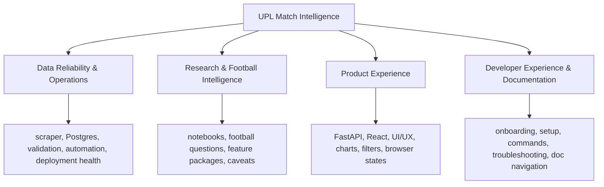

# Start Here

This is the first orientation document for UPL Match Intelligence.

The project began as a goal timing analysis and then moved through a seven-step
launch build: scraper, Postgres, staging validation, FastAPI, React, automation,
research promotion, and deployment. That launch sequence is now complete enough
for a basic public product.

From this point forward, the project should be discussed and improved through
four continuous development areas instead of old launch phases.

## The Project In One Minute

UPL Match Intelligence turns official Uganda Premier League match pages into a
small data platform and public football analysis product.

The production path is:

```text
Official UPL website
  -> scraper
  -> raw files and cache
  -> Postgres raw/staging/analytics schemas
  -> FastAPI
  -> React dashboard
```

The product rule is:

```text
React UI -> FastAPI endpoint -> Postgres query/view -> JSON -> chart/table
```

The frontend must not read CSV files, notebooks, or exported notebook images.
Notebooks are the research lab. Postgres is the production data store.

## Four Continuous Development Areas



### 1. Data Reliability & Operations

Purpose: keep the source data, database, automation, and deployment trustworthy.

Owns:

- scraper behavior and source-site changes
- raw CSV outputs and cache behavior
- Postgres migrations and permissions
- raw-to-staging rebuilding
- validation checks and validation issue severity
- current-season automation
- deployment health, secrets, and database roles
- stage logs, run summaries, and escalation rules
- early unit tests around risky data logic

Read first:

- [PROJECT_ROADMAP.md](PROJECT_ROADMAP.md)
- [OPERATIONS.md](OPERATIONS.md)
- [PHASE5_AUTOMATION.md](PHASE5_AUTOMATION.md)
- [PHASE7_DEPLOYMENT_RUNBOOK.md](PHASE7_DEPLOYMENT_RUNBOOK.md)

Useful commands:

```powershell
.venv\Scripts\python.exe scripts\data_platform\update_current_season.py --season 2025-26 --skip-migrations
.venv\Scripts\python.exe scripts\data_platform\verify_raw_postgres_counts.py
.venv\Scripts\python.exe scripts\data_platform\verify_staging_outputs.py
```

Escalate when:

- the scraper cannot reach or parse source pages
- raw counts no longer match loaded Postgres rows
- staging validation finds structural errors
- the API would publish misleading or incomplete data
- routine automation needs admin database privileges
- secrets, passwords, or admin credentials are exposed

### 2. Research & Football Intelligence

Purpose: discover useful football questions and promote only validated insights.

Owns:

- feature notebooks
- research briefs
- product plans for promoted insights
- metric definitions and caveats
- feature registry status
- direct-query versus `analytics.*` view decisions

Read first:

- [FEATURE_PROMOTION_WORKFLOW.md](FEATURE_PROMOTION_WORKFLOW.md)
- [FEATURE_DATA_ACCESS.md](FEATURE_DATA_ACCESS.md)
- [RESEARCH_IDEAS.md](RESEARCH_IDEAS.md)
- [FEATURE_REGISTRY.md](FEATURE_REGISTRY.md)
- [ANALYTICS_VIEW_CONVENTIONS.md](ANALYTICS_VIEW_CONVENTIONS.md)

Useful starting command:

```powershell
Copy-Item -Recurse notebooks\features\_feature_template notebooks\features\feature_02_card_trends
```

Escalate when:

- a dashboard metric cannot be traced back to a notebook, SQL query, or clear
  product plan
- a feature depends on raw data or CSVs without a documented reason
- a finding looks interesting but the source data caveats are too large to show
  publicly without explanation

### 3. Product Experience

Purpose: turn trusted data and validated research into a useful public app.

Owns:

- FastAPI route design
- query/service functions under `src/api/`
- typed API response models
- React pages, filters, tables, charts, and loading states
- frontend API client and response types
- browser-facing error states, including hosted API cold starts

Read first:

- [PROJECT_ROADMAP.md](PROJECT_ROADMAP.md)
- `api/main.py`
- `src/api/queries.py`
- `src/api/schemas.py`
- `frontend/src/App.tsx`
- `frontend/src/api/client.ts`
- `frontend/src/api/types.ts`
- [FRONTEND_UX_REQUESTS.md](FRONTEND_UX_REQUESTS.md)
- [UI_UX_GUIDELINES.md](UI_UX_GUIDELINES.md)

Useful commands:

```powershell
.venv\Scripts\python.exe -m uvicorn api.main:app --reload
cd frontend
npm run dev
npm run build
```

Escalate when:

- React needs data that no API endpoint exposes cleanly
- frontend logic starts duplicating durable SQL or backend query logic
- an API response shape changes in a way that can break the dashboard
- the UI hides important caveats or makes incomplete data look certain

### 4. Developer Experience & Documentation

Purpose: make the project understandable and repeatable for a junior developer,
future contributor, reviewer, or AI agent.

Owns:

- onboarding docs
- local setup instructions
- command guides
- troubleshooting notes
- testing instructions
- documentation navigation
- beginner-readable explanations
- repo conventions such as `AGENTS.md`

Read first:

- [README.md](../README.md)
- [START_HERE.md](START_HERE.md)
- [LOCAL_DEVELOPMENT.md](LOCAL_DEVELOPMENT.md)
- [PROJECT_ROADMAP.md](PROJECT_ROADMAP.md)
- [../AGENTS.md](../AGENTS.md)

Escalate when:

- two docs give conflicting commands
- a new developer cannot tell which doc to read first
- a command works only because of hidden local setup
- a feature or operational decision exists in code but not in the docs

## Logs, Tests, Validation, And Escalation

Use this mental model:

```text
Logs = what happened during a real run.
Tests = what should always be true when code changes.
Validation = whether the current real data is safe and coherent.
Escalation = what to do when logs, tests, or validation reveal risk.
```

Recommended log shape:

```text
outputs/automation/
  scrape.log
  raw-load.log
  raw-verify.log
  staging-build.log
  staging-verify.log
  run-summary.md or run-summary.json
```

Recommended severity ladder:

```text
INFO    Normal progress.
WARNING Odd or incomplete, but not blocking.
ERROR   A stage failed or data quality is unsafe.
FATAL   The run cannot continue.
```

Recommended escalation ladder:

```text
Level 0: Record only
Level 1: Warn in logs or summaries
Level 2: Record a validation issue
Level 3: Fail the automation run
Level 4: Require manual/admin intervention
```

Do not fail the whole pipeline for every source-data imperfection. Do fail when
the app would publish structurally broken or misleading data.

## Where The Old Launch Phases Went

The old launch phases are now historical context:

| Old launch phase | New continuous area |
|------------------|---------------------|
| Scraper stabilization | Data Reliability & Operations |
| Postgres foundation | Data Reliability & Operations |
| Cleaning, validation, analytics models | Data Reliability & Operations; Research & Football Intelligence |
| FastAPI backend | Product Experience |
| React frontend | Product Experience |
| GitHub Actions automation | Data Reliability & Operations |
| Notebook research promotion | Research & Football Intelligence; Product Experience |
| Deployment and portfolio polish | Data Reliability & Operations; Developer Experience & Documentation |

The phase documents and notes can stay as reference, but new work should be
planned, discussed, and reviewed through the four areas above.

## How To Navigate The Docs

Start here when you are unsure where a change belongs. Then use:

- [README.md](../README.md) for the public project overview and live demo.
- [PROJECT_ROADMAP.md](PROJECT_ROADMAP.md) for current planning and priorities.
- [LOCAL_DEVELOPMENT.md](LOCAL_DEVELOPMENT.md) for local setup, common
  commands, verification, and troubleshooting.
- [diagram_collection.md](diagram_collection.md) for a visual overview of the
  codebase, pipeline, database, API flow, and scraper lifecycle.
- [DOCUMENTATION_MAP.md](DOCUMENTATION_MAP.md) for a file-by-file guide to every
  docs file.
- [OPERATIONS.md](OPERATIONS.md) for logs, tests, validation, and escalation.
- Phase-named docs, such as [PHASE5_AUTOMATION.md](PHASE5_AUTOMATION.md),
  [DEPLOYMENT_PLAN.md](DEPLOYMENT_PLAN.md), and
  [PHASE7_DEPLOYMENT_RUNBOOK.md](PHASE7_DEPLOYMENT_RUNBOOK.md), as detailed
  historical references or runbooks.

If two docs disagree, prefer the newer four-area model in this file and the
current roadmap, then update the stale doc in the smallest useful place.

## First Things To Read By Task

If you want to run the project locally:

- [LOCAL_DEVELOPMENT.md](LOCAL_DEVELOPMENT.md)
- [README.md](../README.md)
- `.env.example`
- `frontend/.env.example`

If you want a visual codebase overview:

- [diagram_collection.md](diagram_collection.md)
- [DOCUMENTATION_MAP.md](DOCUMENTATION_MAP.md)

If you want to refresh data:

- [OPERATIONS.md](OPERATIONS.md)
- [PHASE5_AUTOMATION.md](PHASE5_AUTOMATION.md)
- `scripts/data_platform/update_current_season.py`

If you want to add a football insight:

- [RESEARCH_IDEAS.md](RESEARCH_IDEAS.md)
- [FEATURE_PROMOTION_WORKFLOW.md](FEATURE_PROMOTION_WORKFLOW.md)
- [FEATURE_DATA_ACCESS.md](FEATURE_DATA_ACCESS.md)
- [FEATURE_REGISTRY.md](FEATURE_REGISTRY.md)

If you want to improve the app:

- [FRONTEND_UX_REQUESTS.md](FRONTEND_UX_REQUESTS.md)
- [UI_UX_GUIDELINES.md](UI_UX_GUIDELINES.md)
- `api/`
- `src/api/`
- `frontend/src/`
- [PROJECT_ROADMAP.md](PROJECT_ROADMAP.md)

If you want to understand deployment:

- [PHASE7_DEPLOYMENT_RUNBOOK.md](PHASE7_DEPLOYMENT_RUNBOOK.md)
- [DEPLOYMENT_PLAN.md](DEPLOYMENT_PLAN.md)
