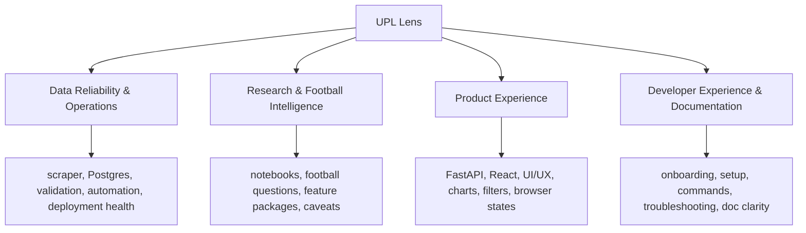

# Start Here

This is the first orientation document for the repository. The public frontend
product formerly known as "UPL Match Intelligence" has been rebranded to
**UPL Lens**. Backend, data-platform, and research workflows remain in this
repo; frontend design direction and launch guidance live under
[UPL_LENS_FRONTEND_START_HERE.md](UPL_LENS_FRONTEND_START_HERE.md).

Use this file when you are new to the repo, returning after a gap, or unsure
which document owns a decision. If your work affects the public frontend
experience, consult [UPL_LENS_FRONTEND_START_HERE.md](UPL_LENS_FRONTEND_START_HERE.md) in addition to the
docs listed below.

## The Project In One Minute

This project turns official Uganda Premier League match pages into a
football intelligence product. The public frontend product is published as
**UPL Lens**.

The production path is:

```text
Official UPL website
  -> scraper
  -> raw files and cache
  -> Postgres raw/staging/analytics schemas
  -> FastAPI
  -> React dashboard
```

The product rule is:

```text
React UI -> FastAPI endpoint -> Postgres query/view -> JSON -> chart/table
```

React must not read CSV files, notebooks, exported notebook images, or local
database files. Notebooks are the research lab. Postgres plus FastAPI is the
production path.

For product identity and positioning, read
[PRODUCT_STRATEGY.md](PRODUCT_STRATEGY.md).

## Current Implementation Phase

The backend has been upgraded for intelligence-layer frontend work. The next
implementation order is:

1. Sync `frontend/src/api/client.ts` and `frontend/src/api/types.ts` with the
   current backend responses.
2. Build reusable chart and visual components for signals, comparisons, and
   data-quality notes.
3. Upgrade the Trends page first.
4. Upgrade Teams and Team Detail.
5. Upgrade Matches and Match Detail.
6. Upgrade Players and Player Detail.
7. Refine Overview and About.

Do not begin page redesigns before checking the current API contract and the
page requirements for that surface.

## Four Continuous Development Areas



### 1. Data Reliability & Operations

Purpose: keep the source data, database, automation, and deployment
trustworthy.

Read first:

- [OPERATIONS.md](OPERATIONS.md)
- [PROJECT_ROADMAP.md](PROJECT_ROADMAP.md)

Useful commands:

```powershell
.venv\Scripts\python.exe scripts\data_platform\update_hosted_data.py --season-scope current --run-type routine-refresh
.venv\Scripts\python.exe scripts\data_platform\verify_raw_postgres_counts.py
.venv\Scripts\python.exe scripts\data_platform\verify_staging_outputs.py
```

Escalate when:

- the scraper cannot reach or parse source pages
- raw counts no longer match loaded Postgres rows
- staging validation finds structural errors
- the API would publish misleading or incomplete data
- routine automation needs admin database privileges
- secrets, passwords, or admin credentials are exposed

### 2. Research & Football Intelligence

Purpose: discover useful football questions and promote only validated
insights.

Read first:

- [FEATURE_PROMOTION_WORKFLOW.md](FEATURE_PROMOTION_WORKFLOW.md)
- [PRODUCT_STRATEGY.md](PRODUCT_STRATEGY.md)

Useful starting command:

```powershell
Copy-Item -Recurse notebooks\features\_feature_template notebooks\features\feature_02_card_trends
```

Escalate when:

- a dashboard metric cannot be traced to a notebook, SQL query, or clear
  product plan
- a feature depends on raw data or CSVs without a documented reason
- a finding looks interesting but the source-data caveats are too large to show
  publicly without explanation

### 3. Product Experience

Purpose: turn trusted data and validated research into a useful public app.

Read first:

- [PRODUCT_STRATEGY.md](PRODUCT_STRATEGY.md)
- [API_CONTRACT.md](API_CONTRACT.md)
- [API_INTELLIGENCE_ENDPOINTS.md](API_INTELLIGENCE_ENDPOINTS.md)
- [UPL_LENS_FRONTEND_START_HERE.md](UPL_LENS_FRONTEND_START_HERE.md)
- [FRONTEND_DESIGN_SYSTEM.md](FRONTEND_DESIGN_SYSTEM.md)
- [FRONTEND_UX_REQUESTS.md](FRONTEND_UX_REQUESTS.md)
- `api/routers/`
- `src/api/query_services/`
- `frontend/src/`

Useful commands:

```powershell
.venv\Scripts\python.exe -m uvicorn api.main:app --reload
cd frontend
npm run dev
npm run build
```

Escalate when:

- React needs data that no API endpoint exposes cleanly
- frontend logic starts duplicating durable SQL or backend query logic
- an API response shape changes in a way that can break the dashboard
- the UI hides important caveats or makes incomplete data look certain

### 4. Developer Experience & Documentation

Purpose: make the project understandable and repeatable for a junior developer,
future contributor, reviewer, or AI agent.

Read first:

- [LOCAL_DEVELOPMENT.md](LOCAL_DEVELOPMENT.md)
- [PROJECT_ROADMAP.md](PROJECT_ROADMAP.md)
- [CHANGELOG.md](CHANGELOG.md)
- [../AGENTS.md](../AGENTS.md)

Escalate when:

- two docs give conflicting commands
- a new developer cannot tell which doc to read first
- a command works only because of hidden local setup
- a feature or operational decision exists in code but not in the docs

## Current Docs

This repo still prefers a small `docs/` surface, but the current frontend
rebrand adds a temporary documentation exception for the UPL Lens launch
package. Treat those extra frontend docs as implementation-specific companions,
not as a new default pattern for splitting every topic into another file.

| Doc | Purpose | Open it when |
|-----|---------|--------------|
| [START_HERE.md](START_HERE.md) | Orientation and doc navigation | You are new, returning, or unsure where a task belongs. |
| [LOCAL_DEVELOPMENT.md](LOCAL_DEVELOPMENT.md) | Local setup, commands, verification, troubleshooting | You want to run or debug the project locally. |
| [OPERATIONS.md](OPERATIONS.md) | Data-refresh, automation, deployment, logs, escalation | You are touching scraping, loading, staging, hosting, or workflow health. |
| [PRODUCT_STRATEGY.md](PRODUCT_STRATEGY.md) | Product identity and decision rules | You are planning product-facing work or checking scope. |
| [API_CONTRACT.md](API_CONTRACT.md) | Frontend-facing API contract for intelligence-layer pages | You need the current route shapes, fields, caveats, and page owners. |
| [API_INTELLIGENCE_ENDPOINTS.md](API_INTELLIGENCE_ENDPOINTS.md) | Routine intelligence API contracts | You are wiring Trends, Teams, Matches, Players, or Overview pages to backend-computed signals. |
| [PROJECT_ROADMAP.md](PROJECT_ROADMAP.md) | Planning map, strengths, gaps, next priorities | You need project direction or milestone context. |
| [FEATURE_PROMOTION_WORKFLOW.md](FEATURE_PROMOTION_WORKFLOW.md) | Research playbook: ideas, data access, promotion, analytics decisions | You are working in notebooks or promoting a football insight. |
| [FRONTEND_DESIGN_SYSTEM.md](FRONTEND_DESIGN_SYSTEM.md) | Frontend playbook: visual system, product UI rules, page templates | You are designing or implementing frontend behavior. |
| [FRONTEND_UX_REQUESTS.md](FRONTEND_UX_REQUESTS.md) | Proposed frontend changes and request workflow | You are capturing or implementing approved UI/UX requests. |
| [UPL_LENS_FRONTEND_START_HERE.md](UPL_LENS_FRONTEND_START_HERE.md) | UPL Lens frontend redesign entrypoint and precedence guide | You are implementing or reviewing the public frontend relaunch. |
| [UPL_LENS_HIGH_FIDELITY_DESIGN_BRIEF.md](UPL_LENS_HIGH_FIDELITY_DESIGN_BRIEF.md) | Highest-priority visual and editorial frontend brief | You need the final launch design direction. |
| [UPL_LENS_TEXT_WIREFRAMES.md](UPL_LENS_TEXT_WIREFRAMES.md) | Canonical text wireframes | You need page structure before implementation details. |
| [UPL_LENS_PAGE_REQUIREMENTS.md](UPL_LENS_PAGE_REQUIREMENTS.md) | Page-by-page frontend functional requirements | You need page scope, states, and data needs. |
| [UPL_LENS_INFORMATION_ARCHITECTURE.md](UPL_LENS_INFORMATION_ARCHITECTURE.md) | Navigation and content model for UPL Lens | You are shaping page hierarchy, navigation, or content relationships. |
| [diagram_collection.md](diagram_collection.md) | Visual system overview | You need architecture, data-flow, API-flow, or scraper diagrams. |
| [CHANGELOG.md](CHANGELOG.md) | High-signal project change history | You want recent context before editing. |

## Reading Paths By Task

If you want to run the project locally:

- [LOCAL_DEVELOPMENT.md](LOCAL_DEVELOPMENT.md)
- [CHANGELOG.md](CHANGELOG.md)
- `.env.example`
- `frontend/.env.example`

If you want to refresh or validate data:

- [OPERATIONS.md](OPERATIONS.md)
- [diagram_collection.md](diagram_collection.md)

If you want to add a football insight:

- [FEATURE_PROMOTION_WORKFLOW.md](FEATURE_PROMOTION_WORKFLOW.md)
- [PRODUCT_STRATEGY.md](PRODUCT_STRATEGY.md)
- the relevant feature folder under `notebooks/features/`

If you want to improve the app:

- [PRODUCT_STRATEGY.md](PRODUCT_STRATEGY.md)
- [API_CONTRACT.md](API_CONTRACT.md)
- [API_INTELLIGENCE_ENDPOINTS.md](API_INTELLIGENCE_ENDPOINTS.md)
- [UPL_LENS_FRONTEND_START_HERE.md](UPL_LENS_FRONTEND_START_HERE.md)
- [FRONTEND_UX_REQUESTS.md](FRONTEND_UX_REQUESTS.md)
- [FRONTEND_DESIGN_SYSTEM.md](FRONTEND_DESIGN_SYSTEM.md)
- `api/`
- `src/api/`
- `frontend/src/`

If you want a visual system overview:

- [diagram_collection.md](diagram_collection.md)
- [PROJECT_ROADMAP.md](PROJECT_ROADMAP.md)

If you want current priorities before touching anything:

- [CHANGELOG.md](CHANGELOG.md)
- [PROJECT_ROADMAP.md](PROJECT_ROADMAP.md)
- [PRODUCT_STRATEGY.md](PRODUCT_STRATEGY.md)

## Logs, Tests, Validation, And Escalation

Use this mental model:

```text
Logs = what happened during a real run.
Tests = what should always be true when code changes.
Validation = whether the current real data is safe and coherent.
Escalation = what to do when logs, tests, or validation reveal risk.
```

Recommended severity ladder:

```text
INFO    Normal progress.
WARNING Odd or incomplete, but not blocking.
ERROR   A stage failed or data quality is unsafe.
FATAL   The run cannot continue.
```

Recommended escalation ladder:

```text
Level 0: Record only
Level 1: Warn in logs or summaries
Level 2: Record a validation issue
Level 3: Fail the automation run
Level 4: Require manual/admin intervention
```

For the detailed version, use [OPERATIONS.md](OPERATIONS.md).

## Where The Old Launch Phases Went

The old launch phases are now historical context, not the main planning model.

| Old launch phase | New continuous area |
|------------------|---------------------|
| Scraper stabilization | Data Reliability & Operations |
| Postgres foundation | Data Reliability & Operations |
| Cleaning, validation, analytics models | Data Reliability & Operations; Research & Football Intelligence |
| FastAPI backend | Product Experience |
| React frontend | Product Experience |
| GitHub Actions automation | Data Reliability & Operations |
| Notebook research promotion | Research & Football Intelligence; Product Experience |
| Deployment and portfolio polish | Data Reliability & Operations; Developer Experience & Documentation |

Use [PROJECT_ROADMAP.md](PROJECT_ROADMAP.md) for the current planning model and
[CHANGELOG.md](CHANGELOG.md) for a concise history of recent work.

## Updating Docs Without Re-Creating Sprawl

Use these rules:

- Update [LOCAL_DEVELOPMENT.md](LOCAL_DEVELOPMENT.md) when setup, common
  commands, verification steps, or local troubleshooting changes.
- Update [OPERATIONS.md](OPERATIONS.md) when logs, tests, validation, GitHub
  Actions behavior, hosted deployment steps, or escalation rules change.
- Update [FEATURE_PROMOTION_WORKFLOW.md](FEATURE_PROMOTION_WORKFLOW.md) when
  notebook workflow, research backlog, data-source rules, feature lifecycle, or
  analytics-promotion rules change.
- Update [FRONTEND_UX_REQUESTS.md](FRONTEND_UX_REQUESTS.md) for proposed UI/UX
  changes and request status.
- Update [FRONTEND_DESIGN_SYSTEM.md](FRONTEND_DESIGN_SYSTEM.md) for approved
  frontend behavior, visual rules, component patterns, and page templates.
- Update the `UPL_LENS_*` docs when the frontend rebrand artifacts themselves
  change: precedence, wireframes, page requirements, information architecture,
  or launch-specific editorial direction.
- Update [PRODUCT_STRATEGY.md](PRODUCT_STRATEGY.md) only when the app's
  identity, audience, positioning, or decision rules change.
- Update [PROJECT_ROADMAP.md](PROJECT_ROADMAP.md) for strengths, gaps,
  near-term priorities, and major planning shifts.
- Update [diagram_collection.md](diagram_collection.md) when architecture,
  workflows, endpoints, database shape, or known gaps change.
- Update [CHANGELOG.md](CHANGELOG.md) when a meaningful repo change ships.

Avoid creating a new doc just because a section is getting detailed. Prefer a
clear section inside an existing source-of-truth file first.
