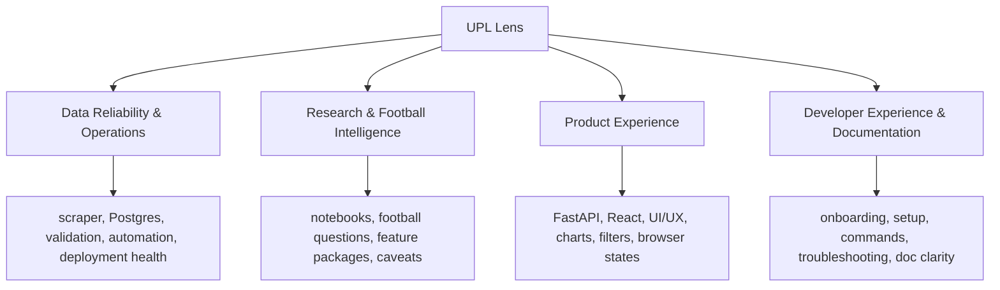

# Start Here

This is the first orientation document for the **UPL Lens** repository. The
project began as a goal-timing / UPL Match Intelligence research build, but the
unified project and product name is now **UPL Lens**. Backend, data-platform,
research, API, frontend, and operations work all live in this repository.

The docs are now consolidated into seven maintained Markdown files. Do not add
a new doc unless the topic cannot fit cleanly into one of these owners. Active
work now belongs in GitHub Issues once it exceeds a small quick fix, needs
planning, affects documentation, or should be resumable by another agent.

## The Project In One Minute

UPL Lens turns official Uganda Premier League match pages into a football
intelligence product.

```text
Official UPL website
  -> scraper
  -> raw files and cache
  -> Postgres raw/staging/analytics schemas
  -> FastAPI
  -> React dashboard
```

The browser-facing contract is:

```text
React UI -> FastAPI endpoint -> Postgres query/view -> JSON -> chart/table
```

React must not read CSV files, notebooks, exported notebook images, or local
database files. Notebooks are the research lab. Postgres plus FastAPI is the
production path.

## Current Release Phase

UPL Lens is in v1.0 public-release hardening. The core production path exists:
the scraper loads Postgres, FastAPI exposes read endpoints, React consumes
FastAPI JSON, the public frontend is hosted on Cloudflare Pages, and routine
hosted refresh runs through GitHub Actions.

The intelligence-layer frontend build order from June is now historical. The
merged app has:

- synced frontend API client/types for the current intelligence endpoints
- reusable intelligence primitives for charts, comparisons, signals, timelines,
  form strips, and data-quality notes
- product pages for Overview, Matches, Match Detail, Teams, Team Detail,
  Players, Player Detail, Insights, Trends, Goal Timing, and About/Methodology
- cross-route QA guidance for future Product Experience PRs

Current release work should focus on:

1. Owner review and browser QA for the public frontend.
2. Data Reliability & Operations hardening for hosted refresh behavior,
   cache/proxy safety, observability, and routine-versus-admin workflow
   separation.
3. Documentation and release notes that describe what is actually merged.
4. Feature 2 research planning, most likely discipline/card intelligence, after
   public-release blockers are handled.

Do not treat unmerged PRs as shipped behavior. Use GitHub Issues and PRs for
the live task board; the frontend guide owns durable rules and launch
acceptance, not day-to-day status.

## GitHub-Native Workflow

Use this operating rule:

```text
Docs explain the system.
Issues move the work.
Branches isolate the work.
Pull Requests review the work.
Projects show workflow state.
Milestones define release goals.
Releases record what shipped.
Agents work from Issues when available.
The owner approves closure and release.
```

The default Project pipeline is:

```text
Inbox -> Research -> Ready -> In Progress -> Review / QA -> Done -> Released -> Parked
```

Use `.github/ISSUE_TEMPLATE/` for new work. The initial frontend and
discipline-research seed Issues have been created in GitHub, with reusable
local drafts kept in `.github/ISSUE_DRAFTS/`. Meaningful work should happen on
an Issue-specific branch and enter `main` through a Pull Request after owner
review.

Beginner defaults:

- No file change: no branch is needed.
- Small clear file change: branch and PR; Issue optional.
- Meaningful, risky, unclear, milestone, research, API, data, or frontend work:
  Issue -> branch -> draft PR -> owner test/review -> merge.
- Keep PRs draft until the linked Issue checklist and acceptance criteria are
  complete.
- Test PRs locally or through a preview deployment before merging.
- Delete merged short-lived branches unless the owner intentionally wants to
  preserve an experiment.

## Seven-Doc Structure

| Doc | Owner | Open it when |
|-----|-------|--------------|
| [START_HERE.md](START_HERE.md) | Orientation, doc map, current phase, recent history | You are new, returning, or deciding where work belongs. |
| [PRODUCT_STRATEGY.md](PRODUCT_STRATEGY.md) | Product identity and decision rules | You are planning product-facing work or checking scope. |
| [PROJECT_ROADMAP.md](PROJECT_ROADMAP.md) | Planning, GitHub workflow, milestones, strengths, gaps, priorities | You need the current implementation order, work-management rules, or historical roadmap context. |
| [FEATURE_PROMOTION_WORKFLOW.md](FEATURE_PROMOTION_WORKFLOW.md) | Research workflow and notebook-to-product promotion | You are working in notebooks or promoting a football insight. |
| [LOCAL_DEVELOPMENT.md](LOCAL_DEVELOPMENT.md) | Local setup, verification, operations, automation, troubleshooting | You need to run, validate, refresh, deploy, or debug the system. |
| [FRONTEND_DESIGN_SYSTEM.md](FRONTEND_DESIGN_SYSTEM.md) | Frontend design, API contract, page requirements, wireframes, seed issue list | You are changing UI, routes, frontend data flow, charts, or public product pages. |
| [diagram_collection.md](diagram_collection.md) | Visual architecture reference | You need architecture, data-flow, API-flow, database, scraper, or frontend diagrams. |

`visual_inspo.png` remains in `docs/` as a visual asset, not a standalone doc.

## Reading Paths By Task

If you want to run the project locally:

- [LOCAL_DEVELOPMENT.md](LOCAL_DEVELOPMENT.md)
- `.env.example`
- `frontend/.env.example`

If you want to refresh, validate, or troubleshoot data:

- [LOCAL_DEVELOPMENT.md](LOCAL_DEVELOPMENT.md)
- [diagram_collection.md](diagram_collection.md)

If you want to add or promote a football insight:

- [FEATURE_PROMOTION_WORKFLOW.md](FEATURE_PROMOTION_WORKFLOW.md)
- [PRODUCT_STRATEGY.md](PRODUCT_STRATEGY.md)
- the relevant feature folder under `notebooks/features/`

If you want to improve the app:

- [PRODUCT_STRATEGY.md](PRODUCT_STRATEGY.md)
- [FRONTEND_DESIGN_SYSTEM.md](FRONTEND_DESIGN_SYSTEM.md)
- `api/`
- `src/api/`
- `frontend/src/`

If you want current priorities:

- this file
- [PROJECT_ROADMAP.md](PROJECT_ROADMAP.md)
- [PRODUCT_STRATEGY.md](PRODUCT_STRATEGY.md)

## Four Continuous Development Areas



### Data Reliability & Operations

Purpose: keep the source data, database, automation, and deployment
trustworthy.

Read first:

- [LOCAL_DEVELOPMENT.md](LOCAL_DEVELOPMENT.md)
- [PROJECT_ROADMAP.md](PROJECT_ROADMAP.md)
- [diagram_collection.md](diagram_collection.md)

Escalate when the scraper cannot parse source pages, raw counts disagree with
Postgres rows, staging validation finds structural errors, the API would
publish misleading data, routine automation needs admin privileges, or secrets
are exposed.

### Research & Football Intelligence

Purpose: discover useful football questions and promote only validated
insights.

Read first:

- [FEATURE_PROMOTION_WORKFLOW.md](FEATURE_PROMOTION_WORKFLOW.md)
- [PRODUCT_STRATEGY.md](PRODUCT_STRATEGY.md)

Escalate when a dashboard metric cannot be traced to a notebook, SQL query, or
clear product plan.

### Product Experience

Purpose: turn trusted data and validated research into a useful public app.

Read first:

- [PRODUCT_STRATEGY.md](PRODUCT_STRATEGY.md)
- [FRONTEND_DESIGN_SYSTEM.md](FRONTEND_DESIGN_SYSTEM.md)
- `api/routers/`
- `src/api/query_services/`
- `frontend/src/`

Escalate when React needs data that no endpoint exposes cleanly, frontend logic
starts duplicating durable backend logic, a response shape change can break the
dashboard, or the UI hides caveats.

### Developer Experience & Documentation

Purpose: make the project understandable and repeatable for a junior developer,
future contributor, reviewer, or AI agent.

Read first:

- [LOCAL_DEVELOPMENT.md](LOCAL_DEVELOPMENT.md)
- [PROJECT_ROADMAP.md](PROJECT_ROADMAP.md)
- [../AGENTS.md](../AGENTS.md)

Escalate when two docs give conflicting commands, a new developer cannot tell
which doc to read first, a command depends on hidden local setup, or a feature
decision exists in code but not in docs.

## Recent History

### 2026-07-16

- Reconciled the canonical docs with the merged intelligence-layer frontend:
  API client sync, reusable intelligence primitives, Trends, Teams, Matches,
  Players, Insights, Overview, and About/Methodology are now part of the merged
  release foundation rather than future build-order items.
- Clarified that v1.0 work is now public-release hardening: owner QA,
  operations safety, release documentation, and follow-up research planning.
- Recorded the cache-safety, hosted-observability, and workflow-mode separation
  work as merged release-hardening foundations; remaining release QA stays
  tracked in GitHub.

### 2026-07-15

- Added the cross-route frontend QA checklist so Product Experience PRs have a
  durable route/state/browser verification companion.

### 2026-07-14

- Aligned shared image-backed page heroes and continued public frontend polish
  across the merged product routes.


### 2026-06-10

- Consolidated the docs into seven maintained Markdown files.
- Folded API, frontend launch, page requirement, wireframe, UX request,
  operations, and changelog material into the owning docs.
- Kept [diagram_collection.md](diagram_collection.md) as the visual system and
  architecture reference.
- Added the GitHub-native work-management rule: docs hold durable system
  knowledge, while Issues track active work.

### 2026-06-06

- Added a frontend-facing API contract and linked it from the main docs
  entrypoints.
- Documented the backend intelligence-layer page roles, endpoint mapping, and
  page-by-page upgrade order.
- Added frontend work guidance for API client sync, reusable intelligence
  components, and page upgrades.
- Clarified docs and agent guidance around UPL Lens naming, launch precedence,
  and frontend skills.

### 2026-06-05

- Updated roadmap and diagram public-product language so Product Experience
  planning points at UPL Lens while preserving the former UPL Match Intelligence
  name only as historical context.

### 2026-05-31

- Added the UPL Lens frontend launch package and `visual_inspo.png`.
- Linked the launch material from central docs as a temporary exception to the
  older doc cap. That temporary exception has now been folded into the seven-doc
  structure.

### 2026-05-26

- Consolidated the earlier docs set, merged navigation guidance into
  `START_HERE.md`, and established the small-doc-surface standard.

## Updating Docs Without Re-Creating Sprawl

- Update [START_HERE.md](START_HERE.md) for navigation, current phase, doc
  structure, and recent high-signal history.
- Update [PRODUCT_STRATEGY.md](PRODUCT_STRATEGY.md) only when identity,
  audience, positioning, or product decision rules change.
- Update [PROJECT_ROADMAP.md](PROJECT_ROADMAP.md) for strengths, gaps,
  milestones, and planning shifts.
- Update [FEATURE_PROMOTION_WORKFLOW.md](FEATURE_PROMOTION_WORKFLOW.md) for
  notebook workflow, data-source rules, feature lifecycle, or promotion rules.
- Update [LOCAL_DEVELOPMENT.md](LOCAL_DEVELOPMENT.md) for setup, commands,
  verification, operations, GitHub Actions, hosted troubleshooting, and
  escalation.
- Update [FRONTEND_DESIGN_SYSTEM.md](FRONTEND_DESIGN_SYSTEM.md) for API
  contracts, frontend visual rules, UX requests, page requirements, wireframes,
  and launch decisions.
- Update [diagram_collection.md](diagram_collection.md) when architecture,
  workflows, endpoints, database shape, or known gaps change.

Avoid creating a new doc just because a section is getting detailed. Prefer a
clear section inside an existing source-of-truth file first.
