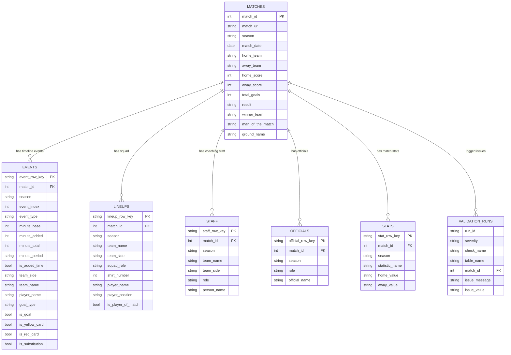
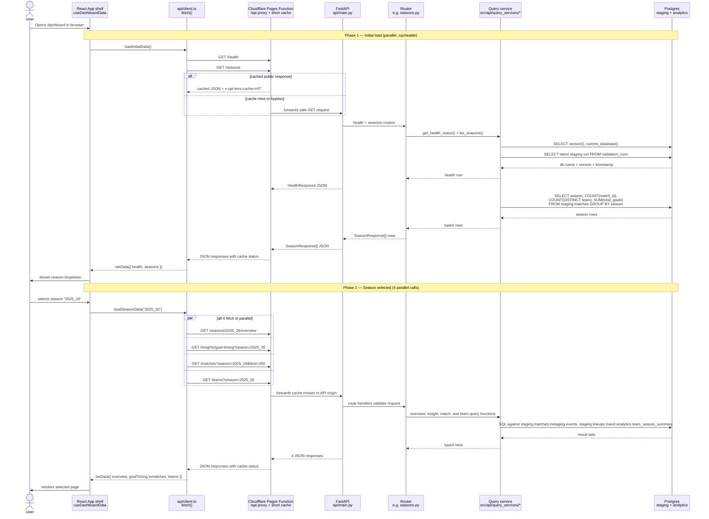
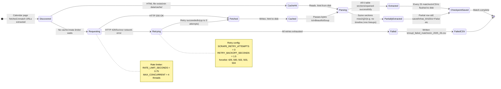

# UPL Lens - Mermaid Diagram Collection

Status: **visual system overview / maintained architecture reference**. These
diagrams describe the repo's data platform, API, and UPL Lens public frontend.

Use this file when you need a high-level visual map of the codebase, data
pipeline, database shape, API flow, or scraper lifecycle. Keep it accurate when
code changes affect the architecture, major workflows, endpoints, database
tables, or known gaps.

Current planning home: use [START_HERE.md](START_HERE.md) for the four
continuous development areas and concise recent-history context.

---

## Diagram 1 — Detailed Two-Flow Data Pipeline
> Solid lines = primary automated flow. Dashed lines = research/promotion flow.
> ⚠️ marks known gaps or areas worth improving.

```mermaid
flowchart TD

    %% ═══════════════════════════════
    %% EXTERNAL SOURCE
    %% ═══════════════════════════════
    WEB(["🌐 upl.co.ug\nOfficial UPL website"])

    %% ═══════════════════════════════
    %% AUTOMATION TRIGGER
    %% ═══════════════════════════════
    GA["⚙️ GitHub Actions\nweekly trigger\n--season 2025-26"]
    GA -->|"runs"| ORCH

    ORCH["🎛️ update_hosted_data.py\noperator wrapper\n→ update_current_season.py\nscrape · migrate/load · verify · staging"]

    %% ═══════════════════════════════
    %% STEP 1: SCRAPING
    %% ═══════════════════════════════
    ORCH -->|"step 1"| SCRAPER

    subgraph SCRAPING["PRIMARY ① — Scraping"]
        direction TB
        SCRAPER["⚙️ scrape_upl_matches.py\ncommand wrapper\n→ src/scraping/upl/*\nclient · parsing · pipeline\npostgres state · dataframes"]

        CACHE[("📦 data/cache/\nHTML per URL\nMD5-keyed files\nPrevents re-download")]

        SCRAPER <-->|"read/write\ncached HTML"| CACHE

        SCRAPER --> PREFLIGHT
        PREFLIGHT["🛡️ source preflight\nHTTP · HTML type · source URL\nstructure + links vs reviewed baseline\nwrites attempt evidence JSON"]
        PREFLIGHT -->|"passed"| CSV
        PREFLIGHT -->|"blocked"| SOURCEFAIL
        SCRAPER -->|"match failure after retries"| FAILED

        CSV[("📁 data/raw/2025_26/\nmatches · events · lineups\nstaff · officials · stats\nsource-preflight contract")]

        SOURCEFAIL["⛔ source-health failure\nraw · staging · analytics\nwrites skipped"]
        FAILED[("📁 upl_failed_matches\n_2025_26.csv\nmatch_url · attempt_count\nlast_error · timestamp")]
    end

    WEB -->|"GET /event/<id>/\nGET /calendar/"| SCRAPER

    NOTE1["ℹ️ Current behavior:\nPostgres change detection is\nactive by default for full\ncurrent-season refreshes.\nUse force-full-scrape only\nfor investigation or rebuilds."]
    SCRAPING -.->|"operator note"| NOTE1

    %% ═══════════════════════════════
    %% STEP 2: RAW LOAD
    %% ═══════════════════════════════
    ORCH -->|"step 2"| RAWLOAD

    subgraph RAW_INGESTION["PRIMARY ② — Raw Ingestion"]
        direction TB
        RAWLOAD["📥 load_raw_to_postgres.py\n→ src/db/raw_loader.py\nroutine mode:\n  1. validate full source/identity set\n  2. read scraper refresh plan\n  3. delete affected match IDs only\n  4. upsert affected raw.* rows\nadmin --full-rebuild:\n  delete/reload full season"]

        RAWVERIFY["✅ verify_raw_postgres_counts.py\ncompares CSV row counts\nvs Postgres row counts\nflags mismatches"]

        RAWLOAD --> RAWVERIFY
    end

    CSV -->|"reads"| RAWLOAD
    FAILED -->|"reads"| RAWLOAD

    subgraph PGRAW["🐘 Postgres — raw schema"]
        direction LR
        R1["raw.matches\n1 row per match\nconflict on match_id"]
        R2["raw.events\nconflict on event_row_key\n(SHA-256 fingerprint)"]
        R3["raw.lineups\nraw.staff\nraw.officials\nraw.stats"]
        R4["raw.failed_matches\nconflict on\nfailed_match_row_key"]
    end

    RAWLOAD -->|"upserts"| PGRAW

    NOTE2["⚠️ GAP: raw.* tables have\nno foreign keys between\nmatches and child tables.\nIntegrity is checked by\nraw-load safety guards and\nstaging validation."]
    PGRAW -.->|"known gap"| NOTE2

    %% ═══════════════════════════════
    %% STEP 3: STAGING
    %% ═══════════════════════════════
    ORCH -->|"step 3"| STAGLOAD

    subgraph STAGING_BUILD["PRIMARY ③ — Staging Build"]
        direction TB
        STAGLOAD["🧹 build_staging_from_raw.py\n→ src/db/staging/* package\nstaging_loader.py facade\nReads raw.* via SQLAlchemy\nSplits models · IO · transforms\nvalidation · writers · analytics\nLogs issues to validation_runs"]

        STAGVERIFY["✅ verify_staging_outputs.py\nspot-checks staging tables:\n  • row counts\n  • null rates on key columns\n  • season coverage"]

        STAGLOAD --> STAGVERIFY
    end

    PGRAW -->|"SELECT * FROM raw.*"| STAGLOAD

    subgraph PGSTAGE["🐘 Postgres — staging schema"]
        direction LR
        S1["staging.matches\n+result · +winner_team\n+total_goals · +goal_difference\n+match_date (Date)"]
        S2["staging.events\n+minute_base/added/total\n+minute_period (0-15…90+)\n+is_goal · is_yellow_card\n+is_red_card · is_substitution\n+team_name (resolved from side)"]
        S3["staging.lineups\nstaging.staff\nstaging.officials\nstaging.stats"]
        S4["staging.validation_runs\nseverity · check_name\nmatch_id · issue_message"]
    end

    STAGLOAD -->|"writes cleaned rows"| PGSTAGE

    subgraph PGANALYTICS["🐘 Postgres — analytics schema"]
        direction LR
        A1["analytics.team_season_summary\nstored team-season rows\nmatches · goals · wins/draws/losses\nrefreshed after staging rebuild"]
    end

    STAGLOAD -->|"refreshes summaries"| PGANALYTICS

    NOTE3["⚠️ GAP: Most reusable metrics\nstill need analytics objects.\nDiscipline, official, home/away,\nand match-drama summaries are\nnot promoted yet."]
    PGANALYTICS -.->|"remaining analytics backlog"| NOTE3

    %% ═══════════════════════════════
    %% SECONDARY: RESEARCH FLOW
    %% ═══════════════════════════════
    subgraph RESEARCH["SECONDARY — Research & Promotion"]
        direction TB
        NB["📓 analysis.ipynb\nExploratory queries\nCharts · stats · hypotheses"]
        RB["📝 research_brief.md\nFootball question defined\nMetric definitions\nCaveats documented"]
        PP["📋 product_plan.md\nPromotion decision\nSQL design\nAPI shape\nReact UI plan"]
        REG["📒 docs/FEATURE_PROMOTION_WORKFLOW.md\nLifecycle + backlog\nexperiment → promoted"]

        NB --> RB --> PP --> REG
    end

    PGSTAGE -.->|"read_sql() queries\nstaging.* for exploration"| NB
    PP -.->|"defines query\nfor endpoint"| INSIGHTS

    INSIGHTS["📊 Promoted insight\n/insights/goal-timing\nSQL query over staging.events\nintervals · goals · share · peak\n\n⚠️ GAP: No analytics.* view.\nQuery re-runs on every\nAPI call. Should become\na named view or mat. view."]

    NOTE4["⚠️ GAP: Only 1 insight\npromoted so far (goal timing).\nCard trends, official discipline,\nhome/away advantage etc are\nstill research ideas only."]
    RESEARCH -.->|"backlog"| NOTE4

    %% ═══════════════════════════════
    %% API LAYER
    %% ═══════════════════════════════
    subgraph API["⚡ FastAPI — api/"]
        direction LR
        DIRECT["Read queries\nsrc/api/query_services/*\nqueries.py facade\nGET /seasons\nGET /matches\nGET /teams (analytics)\nGET /events\nGET /officials"]
        INTEL_EP["Routine intelligence endpoints\nGET /trends/seasons\nGET /overview/intelligence\nGET /matches/intelligence\nGET /teams/{slug}/profile\nGET /players/leaderboards\nSee docs/FRONTEND_DESIGN_SYSTEM.md"]
        INS_EP["Insight endpoints\nGET /insights/goal-timing"]
        HEALTH["GET /health\ndb ping\nlatest_staging_completed_at"]
    end

    PGSTAGE -->|"SQL queries\nvia SQLAlchemy"| DIRECT
    PGANALYTICS -->|"precomputed team summaries"| DIRECT
    PGSTAGE -->|"signals + caveats"| INTEL_EP
    PGANALYTICS -->|"team profile summaries"| INTEL_EP
    INSIGHTS -->|"SQL query"| INS_EP
    PGSTAGE -->|"latest run check"| HEALTH

    NOTE5["⚠️ GAP: No pagination\ncursor yet. Limit param\nexists but no next-page\ntoken for large seasons."]
    API -.->|"known gap"| NOTE5

    %% ═══════════════════════════════
    %% FRONTEND
    %% ═══════════════════════════════
    subgraph FRONTEND["⚛️ React — frontend/src/"]
        direction TB
        CLIENT["api/client.ts\napiClient fetch() wrappers\nAPI_BASE_URL from .env"]
        HOOKS["hooks/\nuseDashboardData\nuseHashNavigation\nloadState: idle/loading/success/error"]
        SHELL["App.tsx shell\nAppShell\nsidebar · top bar · bottom nav\nhash-based page switch"]
        PAGES["pages/\nOverview\nGoal Timing\nMatch Explorer\nTeam Insights\nMethodology"]
        COMPONENTS["components/\ncharts · common · matches\nnavigation · overview\nseason · teams"]

        CLIENT --> HOOKS --> SHELL --> PAGES --> COMPONENTS
    end

    DIRECT -->|"JSON :8000"| CLIENT
    INTEL_EP -->|"JSON :8000"| CLIENT
    INS_EP -->|"JSON :8000"| CLIENT
    HEALTH -->|"JSON :8000"| CLIENT

    NOTE6["ℹ️ Current behavior:\nHash navigation keeps the\nfrontend lightweight.\nA fuller router may be useful\nonce deeper detail pages grow."]
    FRONTEND -.->|"operator note"| NOTE6

    %% ═══════════════════════════════
    %% DEPLOY
    %% ═══════════════════════════════
    RENDER["🚀 Render.com\nFastAPI service\nrender.yaml"]
    SUPABASE["🐘 Supabase Postgres\nraw · staging · analytics · app_meta"]
    API -.->|"deployed to"| RENDER
    RENDER -.->|"reads from"| SUPABASE
    PGRAW -.->|"hosted on"| SUPABASE
    PGSTAGE -.->|"hosted on"| SUPABASE
    PGANALYTICS -.->|"hosted on"| SUPABASE

    %% ═══════════════════════════════
    %% STYLES
    %% ═══════════════════════════════
    classDef primary   fill:#0c4a6e,stroke:#38bdf8,color:#e0f2fe,stroke-width:2px
    classDef rawdb     fill:#064e3b,stroke:#34d399,color:#d1fae5,stroke-width:2px
    classDef stagedb   fill:#14532d,stroke:#4ade80,color:#dcfce7,stroke-width:2px
    classDef research  fill:#431407,stroke:#fb923c,color:#ffedd5,stroke-width:2px
    classDef api       fill:#1e1b4b,stroke:#a78bfa,color:#ede9fe,stroke-width:2px
    classDef frontend  fill:#4a044e,stroke:#e879f9,color:#fae8ff,stroke-width:2px
    classDef warning   fill:#422006,stroke:#f59e0b,color:#fef3c7,stroke-width:1px,stroke-dasharray:4
    classDef infra     fill:#1c1917,stroke:#94a3b8,color:#cbd5e1,stroke-width:1px
    classDef source    fill:#172554,stroke:#93c5fd,color:#dbeafe,stroke-width:3px

    class WEB source
    class SCRAPER,CACHE,CSV,FAILED,RAWLOAD,RAWVERIFY,STAGLOAD,STAGVERIFY,ORCH primary
    class R1,R2,R3,R4 rawdb
    class S1,S2,S3,S4 stagedb
    class NB,RB,PP,REG,INSIGHTS research
    class DIRECT,INTEL_EP,INS_EP,HEALTH,API api
    class CLIENT,HOOKS,SHELL,PAGES,COMPONENTS frontend
    class NOTE1,NOTE2,NOTE3,NOTE4,NOTE5,NOTE6 warning
    class GA,RENDER,SUPABASE infra
```

---

## Diagram 2 — Database Entity Relationship (ERD)
> Shows how staging tables relate to each other. All child tables share match_id with staging.matches.

---

## Diagram 3 — API Request Sequence
> What actually happens between the browser and the database when you open the dashboard.

---

## Diagram 4 — Scraper Package & State
> The internal structure of the scraper and what can happen to each match URL.

